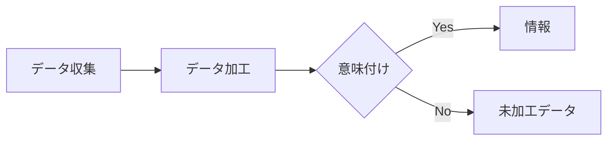

# 1-1 情報とデータ

情報とデータの違いについて理解し、情報の価値や活用法を学習します。

>情報とデータの定義
---
## (1)情報とデータ
**JIS**では、**情報**と**データ**を次のように定義しています。


| 項目 | 説明 |
|:---|:---|
| ① 情報 | 事実、事象、物事、過程、着想などの対象物に関して知り得たことで、概念を含み、一定の文脈中で特定の意味をもつもの。 | 
| ② データ | 情報の表現であって、伝達・解釈・処理に適するように形式化され、再度情報として解釈できるもの。
---
## (2)情報とデータの違い 
情報は英語でinformationといいます。この言葉はinform （知らせる）にation （行動、状態、結果を意味する）がついた単語で「伝える・通知する」という意味を持っています。また、データは資料、数値、観察の結果から得られた事実のことをいいます。 まずは物事を観察し、事実・記録します。これがデータです。 そして、このデータに対し、加山に分析を行うと、何らかの意図・意味を得ることができます。これが情報です。 つまり、データとは客観的な事実であり、そのデータに解釈を加え、意味を与えたものが情報ということもできます。

## (3)情報処理とデータ処理
関連事項として、**情報処理**と**データ処理**について、JISは次のように定義しています。
| 項目 | 説明 |
|:---|:---|
| ① 情報処理 | 情報に対して行われる、データ処理を含む操作の体系的実施。データ処理、オフィスオートメーションなどの操作を含むことがある。 |
| ② データ処理 | データに対して行われる操作の体系的実施。 |

>情報の特徴と活用
## (1)情報の特徴
情報は受け手によって、その価値が異なるという特徴があります。
たとえば、Web上（ホームページ上）の検索エンジンで調べものをするとき、検索したデータが自分にとって意味があれば情報になりますが、意味がなければ、それはただのデータであり情報にはなりません。つまり、情報は必要な人にのみ有効となるのです。人によって、受け取る**情報の価値**（そのデータが持つ意味）が異なるからです。
## （2）情報の活用
世の中にはたくさんの情報が存在します。しかし、なかには、一見、価値のある情報のように見えても、データに何らかの意図が加えられ、データ自体が事実と違うものにゆがめられている情報もあります。
ですから、情報を鵜呑みにするのでなく、意味を整理し、あふれる情報の中から、正しい情報を判断し、自分にとって、必要かつ、もっとも有効な情報はどれなのかを選択する必要があります。
そのためには、どのメディアを使えば効率よく必要な情報を入手できるのか、そして、入手した情報を自分に役立たせるためには、どのように整理し、加工すればよいのか、また、どのように相手に伝えればうまく伝わるのか、といった情報活用スキルが必要となります。このスキルを**情報リテラシー**といいます。

> ➤**情報漏えい**：情報漏えいは、重大な結果を引き起こすことがあります。自分には利用価値がなくても、ほかの人にとっては重要な情報になりうることを認識しなくてはなりません。情報の扱いには、十分に注意しましよう。

> ➤**紙おむつと缶ビール**：アメリカでのことですが、レシートの分析から紙おむつと缶ビールを同時に買う人が多いことを調べたスーパーが、紙おむつの隣に缶ビールを並べたところ、両方の商品の売上が増加したといいます。「紙おむつを買う」ことと「缶ビールを買う」
ことのように関係のないデータから、そこに潜む関係性やルールを見つけ出す
（発掘する：マイニング） ことをデータマイニングといいます。これは、情報の活用例の1つといえます。

## 見出し (Headings)

## H2 見出し

### H3 見出し

#### H4 見出し

##### H5 見出し.


###### H6 見出し

---

## 強調 (Emphasis)

- 通常のテキスト
- *イタリック*
- **ボールド**
- ***ボールド＋イタリック***
- ~~取り消し線~~
- インラインコード: `const x = 42;`

---

## 引用 (Blockquote)

> 情報は「意味のあるデータ」であり、データは観測・計測・記録された値です。
>
> - 出典: 架空の教科書

---

## リスト (Lists)

- 箇条書き 1
- 箇条書き 2
  - 入れ子 2-1
  - 入れ子 2-2
    - 入れ子 2-2-1

1. 番号付き 1
2. 番号付き 2
   1. サブ 2-1
   2. サブ 2-2

- [ ] タスクリスト (未完了)
- [x] タスクリスト (完了)

---

## リンクと画像 (Links & Images)

- 外部リンク: [Myan Myan Learn](https://example.com)
- 相対リンク例: `courses/jken/1-2.md` (Reader では直接はリンクしません)
- 画像 (外部):
  
  

- 画像 (ローカル・相対パス):

  

---

## コード (Code)

インライン: `SELECT * FROM data;`

フェンスドコード (言語: javascript)

```javascript
// データの例
const data = [
  { id: 1, name: 'Alice', score: 88 },
  { id: 2, name: 'Bob', score: 76 },
  { id: 3, name: 'Carol', score: 93 },
];

// 平均スコアを計算
const avg = data.reduce((s, x) => s + x.score, 0) / data.length;
console.log('Average:', avg.toFixed(2));
```

フェンスドコード (言語: json)

```json
{
  "id": 1,
  "title": "情報とデータ",
  "values": [0, 1, 1, 2, 3, 5]
}
```

フェンスドコード (言語: sql)

```sql
CREATE TABLE samples (
  id INT PRIMARY KEY,
  label VARCHAR(50),
  value INT
);

INSERT INTO samples (id, label, value) VALUES
  (1, 'A', 10),
  (2, 'B', 20),
  (3, 'C', 30);
```

---

## 表 (Tables)

| 項目 | 説明 | 値 |
|:---|:---|---:|
| A | データ点 | 10 |
| B | データ点 | 20 |
| C | データ点 | 30 |

---

## 区切り線 (Horizontal Rules)

---
---
---

---

## Mermaid ダイアグラム (Diagram)



---

## 定義リスト (Definition List)

用語A
: 説明A（情報の解釈）

用語B
: 説明B（データの前処理）

---

## 脚注 (Footnotes)

サンプル文。脚注の例はこちら[^1]。

[^1]: これは脚注のサンプルです。

---

## 数式（プレーンテキスト例）

- 平均: `μ = (1/n) * Σ x_i`
- 分散: `σ^2 = (1/n) * Σ (x_i - μ)^2`

---

## サブ/上付き・数式レンダリング テスト (Sub/Sup & Math Test)

- サブスクリプト: H~2~O
- 上付き: N^2^
- インライン数式: $E = mc^2$

ブロック数式:

$$
\sum_{i=1}^n i = \frac{n(n+1)}{2}
$$

---

## 参考演習 (Practice)

1. データと情報の違いを自分の言葉で説明してください。
2. 上記の JSON データを編集して、`values` に好きな数列を入れてみましょう。
3. Mermaid のフローを変更して、あなたの処理手順を表現してみましょう。
