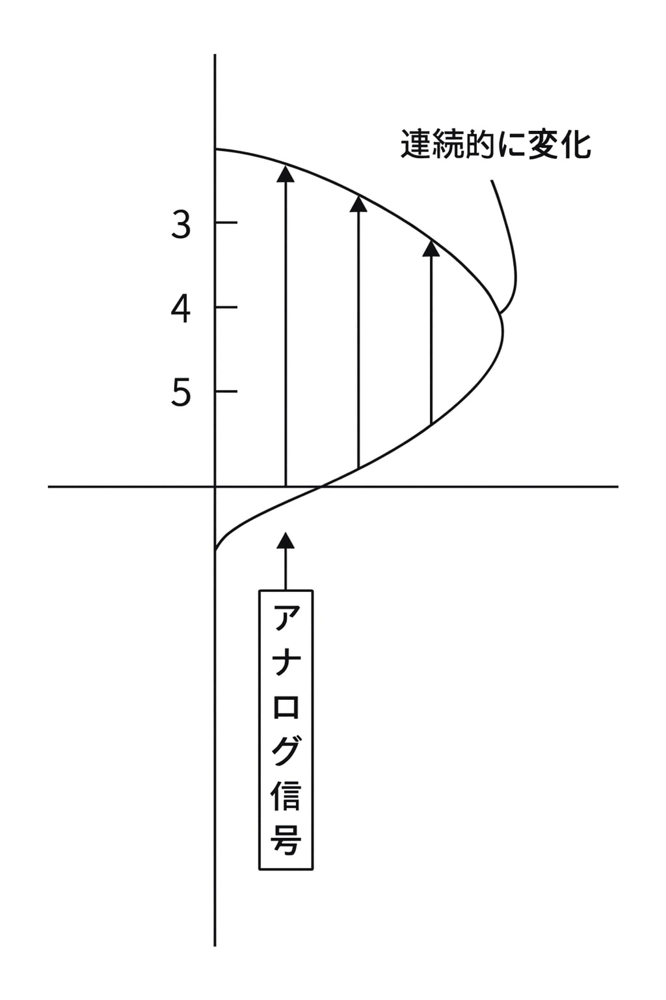

# 1-2　コンピュータでの情報の表現形式
情報やデータの処理形式としてのアナログやディジタルの違い、コンピュータの情報の表現形式について学習します。
---
>●アナログとディジタル
## (1) アナログとディジタルとの違い
**アナログ**は連続した変化をそのまま表現したもので、**ディジタル**は不連続に表現したものです。
#### ①アナログ
アナログは電気回路の電圧や電流などの強弱を、次の図のように連続量で表したものです。したがって、アナログ信号は、原理的には無限の桁数になります。

> ➤声などの音声は、アナログ信号の代表例です。


#### ②ディジタル
ディジタルとは、1つ2つと数で表現できることを意味します。電気信号のON／OFFを動作の基本とし、0と1の値しかとらないディジタルと性質が同じなので、コンピュータではデイジタル信号が利用されています。たとえば、音声のようなアナログ号をディジタル号に変換する場合、次の手順で行います。
     
 ```markdown
 アナログ信号
 (高さが連続して変わる)
          ～～～波～～～
                ↓
        ┌───────────┐
        │   ① 量子化（数字にする） │
        └───────────┘

          3    4    5    6
          │    │    │    │
          ▼    ▼    ▼    ▼

        ┌───────────┐
        │② 2進数へ変換（0/1）│
        └───────────┘

          3 → 011
          4 → 100
          5 → 101
          6 → 110
                ↓
        ┌───────────┐
        │ ③ ディジタルデータ │
        └───────────┘

011100101110...
（0 と 1 がならんだデータ）
```    
    
## (2) アナログとディジタルとの特徴
アナログの場合、雑音が入るとそのまま記録されてしまいますが、ディジタルの場合、多少の雑音は無視されます。
## (3) コンビュータで使用されるディジタル号
コンピュータ内部では、次のような利点からディジタル号を利用しています。
#### ①扱いが簡単
ON／OFFの2つの数値だけを扱うので、回路構造が単純になります。
#### ②雑音に強い
雑音に強いので、誤りが少なくなります。
> ➤ディジタルの場合、ある一定の強さより小さい号は0
とみなされます。同様に、ある一定の強さより大きい言は1とみなされます。
---
>●ビットで表す情報
## (1)ビット
コンピュータ内部ではディジタル号を扱いますが、ON／OFFを表現する単位を**ビット**といいます。通常、ONを1、OFFを0で表現します。
## (2)バイト
ビットが8個集まったものを**バイト**といいます。
## (3)コード
文字や画像を表示する場合のビット配列の決まりを**コード**といいます。たとえば、メーカーや国ごとにコードが異なっていると、一方のコンピュータがディスプレイに「A」と表示しても、他方のコンピュータでは違う文字が表示されます。
インターネットを利用しているとき、わけのわからない文字が表示されることがあります。これは、相手のコンピュータと同じコードを使用していないことがおもな原因です。


```pgsql
ビット（bit）
 ┌───────┐
 │   0   │  OFF
 ├───────┤
 │   1   │  ON
 └───────┘
```
```kotlin
1 Byte = 8 bit

1 Byte のイメージ
┌─┬─┬─┬─┬─┬─┬─┬─┐
│0│1│0│0│0│0│0│1│  ← 8こ（8bit）
└─┴─┴─┴─┴─┴─┴─┴─┘
```
```scss
Byte → KB → MB → GB → TB → PB
 (1000倍) (1000倍) …
 ```
```yaml
1000 Byte = 1 KB
1000 KB   = 1 MB
1000 MB   = 1 GB
1000 GB   = 1 TB
1000 TB   = 1 PB
```
