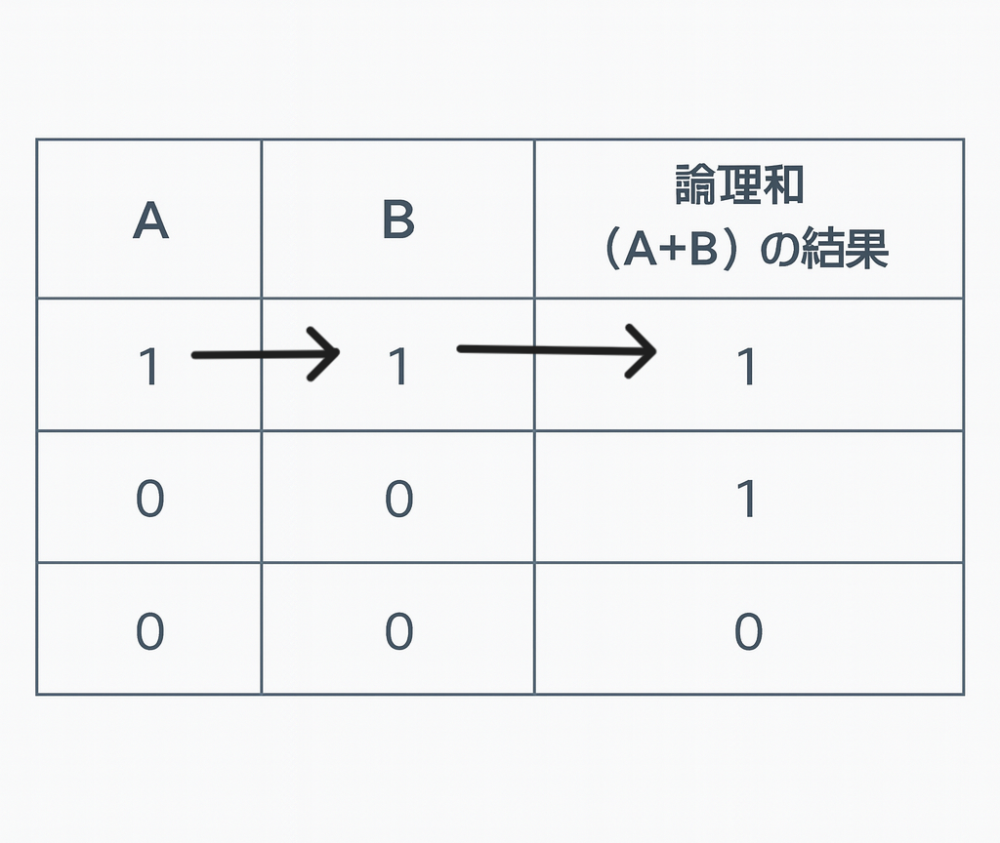
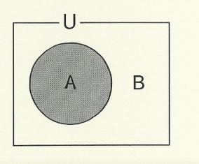
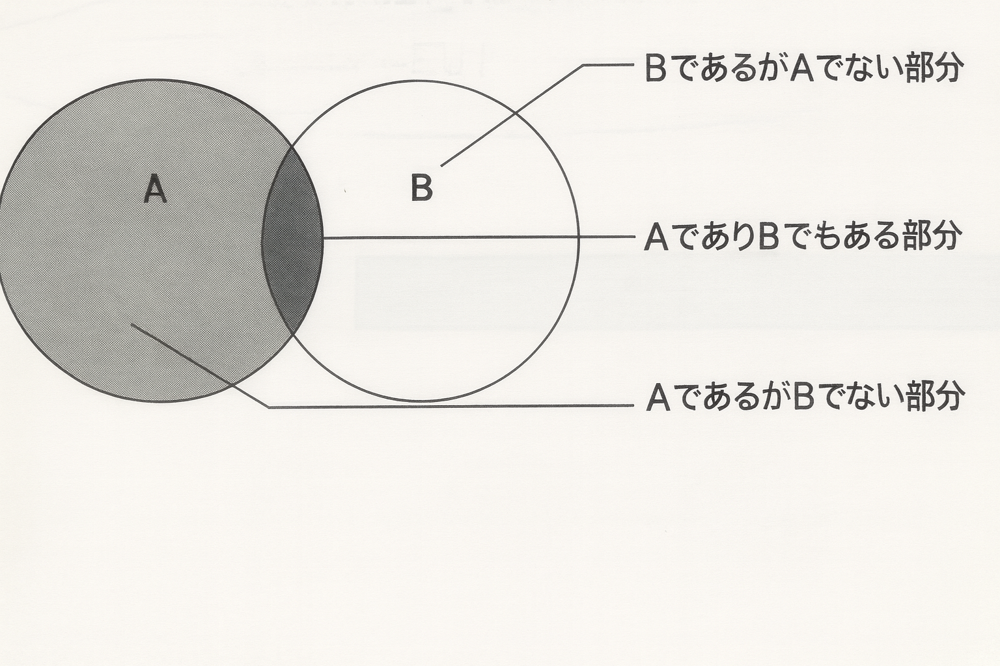

第1章 情報表現と処理手順

# 1-4　論理データの表現法

2値表記で表された論理データの表現方法をベン図と真理値表を用いて学習します。

> ## ● 集合  

集合とは、1つ以上の同一属性をもつ要素の集まりのことです。身近な例を考えると理解しやすくなります。  
たとえば、「男子学生」「女子学生」「クラス全員」「教師」…、「人間」「生物」などが集合です。  
したがって、属性に合わせてさまざまな集合の定義ができます。

> ## ● 論理演算  

論理演算とは、1つの値が2つ以上の状態のいずれかの状態しを判断することを目的とします。また、論理演算は、コンピュータ内部の演算に使用するほか、データベースの検索やインターネットでホームページの検索にも使われます。

>【例1】ある学生の英語の試験結果：  
「平均点以上か」に対し、「以上」「未満」の2つの状態しかないので、論理演算の対象になります。
>
>【例2】花を見る人の感想：  
「美しい」や「きれい」など、2つ以上の状態が存在するので、論理演算の対象となりません。
>
>【例3】検索条件：  
日本の地方都市から人口50万人以上といった場合も、論理演算が使われます。
------
>◆基本的な演算として、論理和（OR演算）、論理積（AND演算）、論理否定（NOT演算）などがあります。
>
>◆条件検索：条件に論理演算子（AND、OR、NOT など）を用いて検索します。

>● 真理値表  

論理演算を行うときにとり得る値と、その結果を表にしたものを、真理値表といいます。

【真理値表の例】：論理和演算の真理値表

表は次のことを示します。Aの状態が1（真）でBの状態が1（真）のとき、AとBの論理和の演算結果は1（真）になります。

> ## ● ベン図  

ベン図は集合を論理演算を図式化したものです。視覚に訴えるため、理解しやすくなります。

### (1) 集合でベン図を使う場合  
一般的に部分集合を○（円）で表し、全体集合は□（四角）で表します。  

通常、全体集合は記号Uを使います。  
Aは集合Aの部分を表します。  
左図の場合、Bは集合Aでない部分（Ā）を表します。

### (2) 論理演算でベン図を使う場合  
一般的に、集合（円）の重なりで表します。

