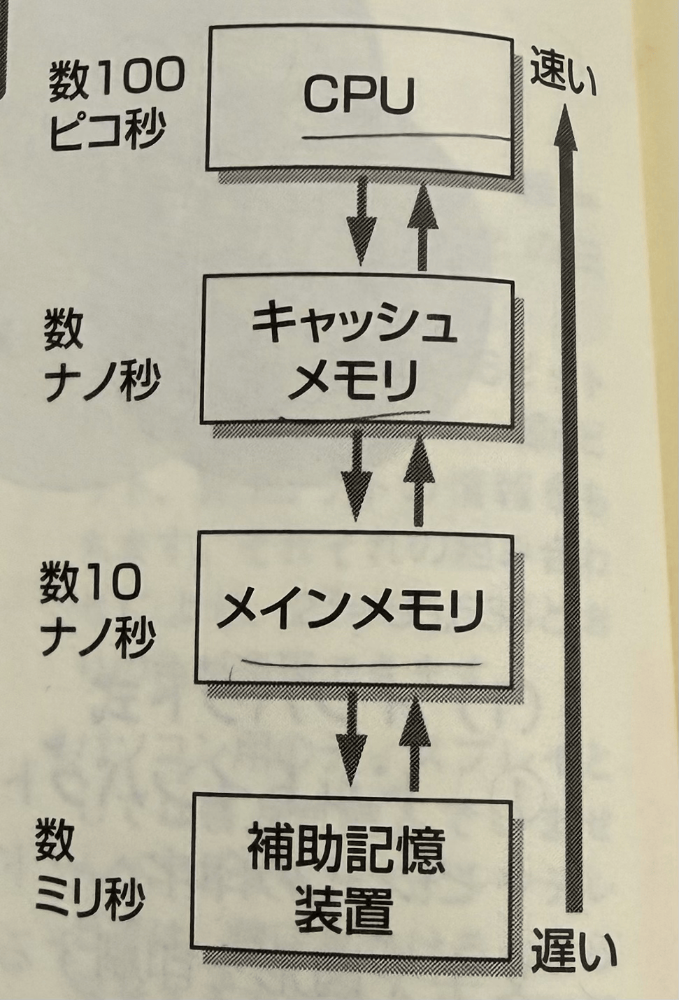

# 2-10　主記憶装置と補助記憶装置

CPUに直接アクセスすることができる主記憶装置と、主記憶装置を補い
記憶する補助記憶装置について学習します。
>**●主記憶装置**

主記憶装置は、メインメモリとキャッシュメモリで構成されています。主記憶装置は、CPUやプログラムと直接データのやりとりができ、処理に必要な命令やデータを格納する半導体の装置です。

## (1) メインメモリ

CPUとメモリの動作速度には、違いがあります。CPUは数
100ピコ～10ナノ秒で動作し、メインメモリは数10ナノ秒～100ナノ秒で動作するため、CPUに待ち時間が発生します。

## (2) キャッシュメモリ

待ち時間の発生を防ぎ、メインメモリからの読み込み時間を少なくするため、キャッシュメモリと呼ばれるメモリを組み合わせます。キャッシュメモリは高速に動作しますが高価です。

>**●メモリの種類と役割**

メモリは半導体素子で構成され、その用途は主記憶装置や
**BIOS**、 **VRAM**などがあります。メモリは、その生質から
RAMとROMに分けられます。

## (1) RAM

読み書きが自由にできるメモリのことで、電源が切れるとその内容は失われます。DRAMとSRAMに区別され、SRAMは高速なデータの読み書きができますが、DRAMはSRAMと比べて読み書きは遅くなります。
パソコンシステムでは、一般に**DRAM**をメインメモリ、**SRAM**をキャッシュメモリと使用
しています。

## (2) ROM

読み込み専用のメモリで、電源を切っても記憶内容は消えません。ROMは、パソコンを起動するときに起動するプログラムを格納するのに使用されます。ROMには、マスクROM、 PROM,EPROM、EEPROMなどがあります。

> キャッシュメモリ：CPUが必要とするデータが、キャッシュメモリ上に存在する確率をヒット率といい、存在しない確率をNFP （Not Found
Probability）といいます。

> BIOS(Basic Input Output System)： ハードウェアの基本的な設定情報やOSの起動情報を保持します。

> VRAM （Video RAM）：画像処理に使用するメモリ

> RAM: Random Access Memory

> SRAM（Static RAM）：トランジスタを利用。容量を上げるには大量のトランジスタが必要になるため、製造コストが高くなります。

> DRAM (Dynamic RAM):
コンデンサを利用しており、集積度を高めることで比較的安価になっています。

>**●補助記憶装置の種類**

## (1) 記録方式による分類

補助記憶装置は、データの読み書き方式の違いにより、**磁性式**、**光学式**、**半導体メモリ式**に分類されます。**磁性式**は磁気のN極・S極を利用し、**光学式**は記録表面の光の反射率の違いや偏光面の向きを利用してデータを記録します。一方、**半導体メモリ式**は不揮発性の半導体メモリにデータを記録します。

## 記録方式の種類と特徴

| 記録方式 | 種類 | 特徴 |
|---------|------|------|
| 磁気式 | 磁気テープ | 比較的安価 |
|        | ハードディスク | 容量が大きい（数100GB〜数TB） |
| 光学式 | CD-ROM、DVD-ROM | 読み取り専用 |
|        | CD-R、DVD-R | 一度しか書けない |
|        | CD-RW、DVD-RW | 読み書きできる |
|        | Blu-ray Disc | 容量が大きく、ハイビジョン映像や大容量データを保存できる |
| 半導体メモリ式 | SSD | 容量単価は高いが高速 |

## (2) データの格納方式による分類

記録媒体にデータを書き込むとき、順アクセス方式とランダムアクセス方式の格納方式があります。磁気テープが順アクセス方式で、それ以外がランダムアクセス方式に分類されます。

### ① 順アクセス方式

テープの先頭から順番に格納する方式で、磁気テープに代表されます。テープの途中にあるデータを読み込む場合、格納されている場所までテープを早送りしたり、巻き戻す必要があります。

### ② ランダムアクセス方式

ランダムアクセス方式は記録媒体を順番に読み込む必要がないため、必要なデータを順アクセス方式より速く取り出すことができます。

> ROM : Read Only Memory

> PROM : Programmable ROM

> EPROM : Erasable PROM

> EEPROM : Electrically EPROM

> SSD : Solid State Drive ソリッドステートドライブ
