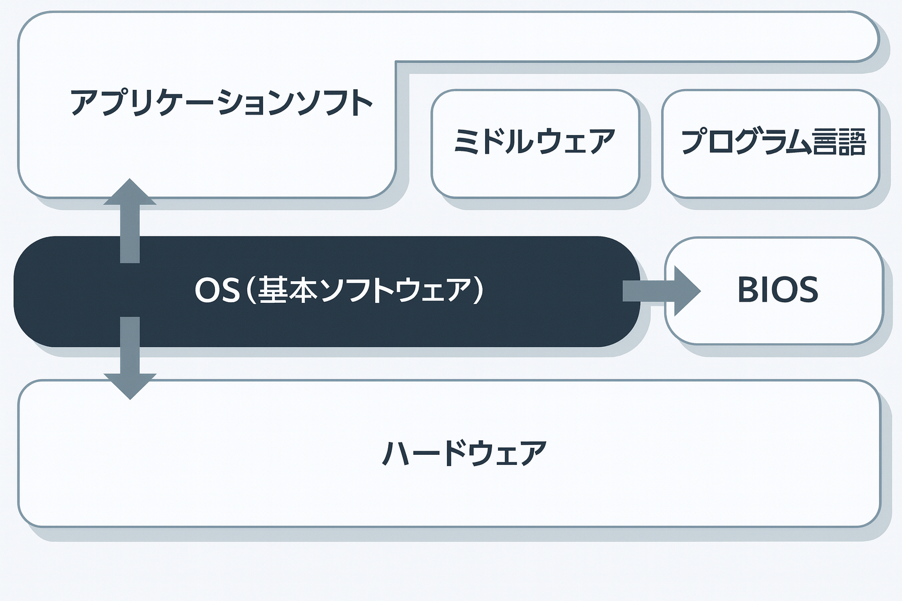

# 第2章 パソコンの基礎

## 2-6　オペレーティングシステム（1）

オベレーティングシステム（OS）の役割と、オペレーティングシステムのおもな種類について学習します。

## ● OSの役割

**OS**はパソコンのもつ機能を利用して、プログラムが効率よく処理できるように、ハードウェアとソフトウェアを管理するプログラムです。

## (1)ハードウェアの管理

入出力や周辺機器をアプリケーションに代わり管理し、利用できる周辺機器などを認識します。また、周辺機器を新たに接続したときは、自動的に設定を行うプラグアンドプレイなどでソフトウェアにその機器を提供します。

## (2) ソフトウェアの管理

処理が効率よく行われるように、プログラムの実行を管理します。同時に複数の処理を行えることをマルチプロセス（並列処理）といいます。処理をしているときに、並列して実行しているプロセスをバックグラウンドプロセスといいます。

 OS (Operating System):
オペレーティングシステム

 プラグアンドプレイ：周辺機器を接続すれば、自動的に設定が行われる機能。

 バックグラウンドプロセス：たとえば、キーボードなどを使って操作している作業の裏で、CPUの空き時間を利用して処理されるプロセスのこと。

 BIOS (Basic Input Output
System)：基本入出力システムを一般的にBIOSといいます。

## ● OSの機能

OSが管理する機能のうち、おもな3つの機能を次に示しま
す。

| 言語        　　| 特徴・用途 |
|-------------|------------|
| メモリ管理     | 主記憶装置を有効に利用するための機能 |
| プロセス管理      | コンピュータ内部での犯理単位であるプロセスに、CPUを効率よく割り当てる機能 |
| ファイル管理 | ファイルシステムを利用してデータ管理を単純にする機能 |

## ● OSのおもな種類

## ① MS-DOS

CUIというコマンドと呼ぶ命令文字をキーボードから入力することによって、パソコンを操作するユーザインタフェースのOSです。シングルタスクで、おもにディスク管理を目的にしています。米国マイクロソフト社が開発したOSで、世界中に普及しました。

## ② Windows

GUIというマウスなどのポインティングデバイスを使って、ウインドウとアイコンを視覚的に操作するユーサインタフェースのOSです。マルチタスクで、OSが周辺機器などを管理できるため、使いやすくなっています。米国マイクロソフト社が開発したOSで、Windows7、Windows8、Windows10などがあります。

## ③ Mac OS

アップルコンピュータ社が開発したMacintoshとともに登場し、グラフィカルユーザインタフェースが普及するきっかけになったOSです。

## ④ UNIX (Unix)

AT&T社のベル研究所が開発したワークステーション用のOSです。CUIが基準ですが、GUI環境を追加することができます。安定性と肩頼性が高く、ネットワーク機能やマルチタスクをサポートするので、おもにサーバOSとして利用されています。

## ⑤ Linux

パソコン用として開発されたUNIX互換OSです。LinuxはOSS（オープンソースソフトウェア）として利用されています。

> この単元の **キーワード**
>
>- オペレーティングシステ
ム（OS）
>- プラグアンドプレイ
>- マルチプロセス
>- バックグラウンドプロセ
ス
>- CUI
>- GUI
>- MS-DOS
>- Windows
>- Mac OS
>- UNIX
>- Linux

 **CUI** (Character-based User
Interface)： キーボードから
コマンドを入力してコンピ
ユータを操作します。

 **GUI** (Graphical User Interface):
コマンドではなく、ポインタとキーボードを使って、ウインドウとアイコンを視覚的に操作できます。

 **UNIX**は商標名ですが、Unix
と表記すると、UNIX互換
OS一般を意味します。

 **Linux**は、ソースプログラムがインターネットで公開され、世界中の研究者やプログラマが機能の追加などに参加したため、機能が充実しました。
