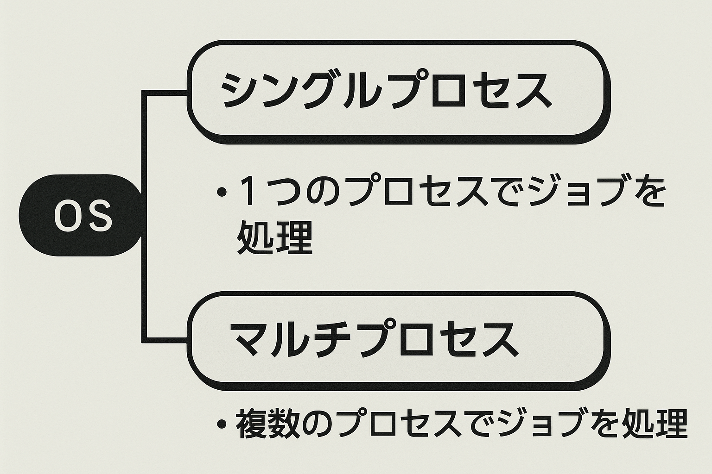
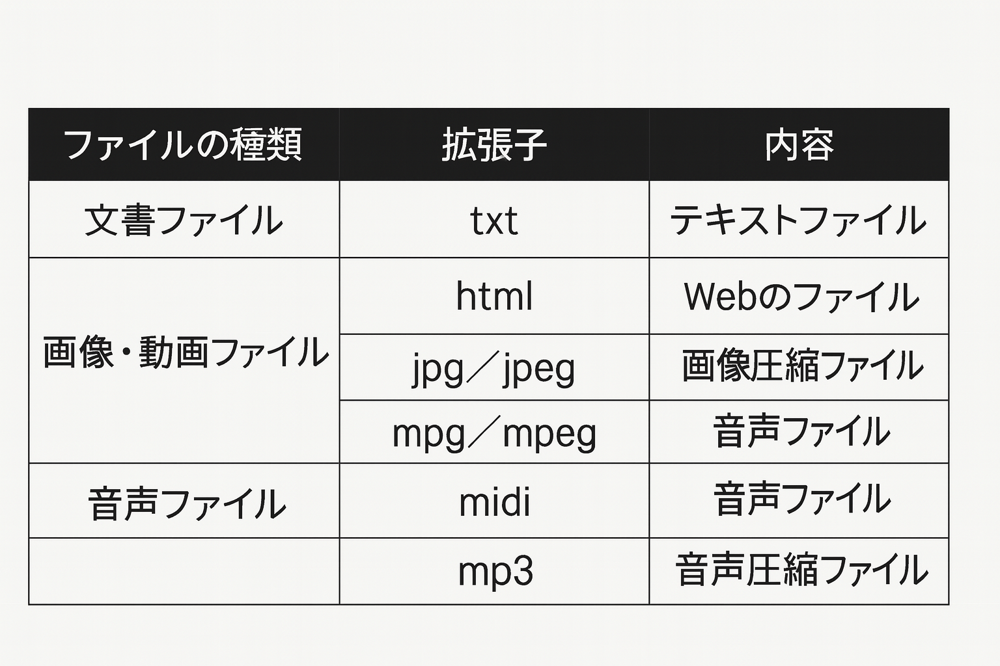
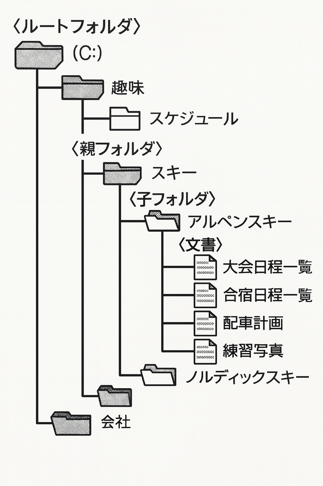

# 第2章 パソコンの基礎

## 2-7　オペレーティングシステム（2）

オペレーティングシステムの基本的な機能であるプロセス管理、ファイ
ル管理について学習します。

## ● プロセス管理

ユーザが音楽ソフトでCDを再生しながら、ワープロソフトで文書を作成しているような場合、パソコン上では処理を並行してできるように、OSがそれぞれの処理を管理しています。
このように、複数の処理を行えるOSをマルチタスクOSといいます。

### (1)  ジョブとプロセス

ユーザがパソコンで行う処理をタスクまたはジョブといい、CPUが行う処理の単位をプロセスといいます。OSはジョブをプロセスという単位で管理します。

① ジョブが1つのプロセスで処理されることをシングルプロセスといいます。

② 複数のプロセスでジョブが処理されることをマルチプロセスといいます。

### (2) マルチタスク

キーボードからの入力待ちの状態や人間が考えている時間は、CPUは使われていません。マルチタスクとは、CPUが空いている時間を別のプロセスに利用して、それぞれのプロセスを並行して処理することをいいます。
このプロセスを分ける時間間隔は人間が感知できないほど短いため、複数のプロセスが中断せずに処理を行っているように感じるのです。

> 一時に1つの処理しか行えないOSをシングルタスクOs
といいます。
>
> マルチプロセスの例：ワープロソフトで文書を作成しているとき、印刷の終了を待つことなく文書を書き続けることができます。

## ● ファイル管理

ワープロなどで作成された文書は、ハードディスクに保存することができます。OSは、これら保存したい内容をファイルとして扱い香理しています。これをファイル管理といい、管理用の領域を**フォルダ**といいます。このフォルダも別のフォルダに格約することができ、このとき格約されるフォルダを子フォルダといい、格納するフォルダを親フォルダといいます。また、親フォルダをたどっていった一番上のフォルダを、ルートフォルダといいます。
このように、階層型にファイルを管理する方法を階層型ディレクトリといいます。

## (1) ファイル名

ファイル名は、OSにより文字数が制限されています。ファイルの内容が理解しやすいように名を付けることで、ファイルの管理がしやすくなります。主ファイル名のピリオドの後にはファイルの種類を表すために拡張子が付けられます。

＜例＞主ファイル名、拡張子

## (2) ファイルの指定方法

フォルダの異なるファイルを特定するときには、パスで指定します。パスの指定方法には、**相対パス**と**絶対パス**があり、相対パスは今あるフォルダを起点に指定する方法、絶対パスはルートディレクトリを起点に指定する方法です。

 UNIXではフォルダのことをディレクトリといいます。

 任意のファイルやディレクトリまでの道筋のことをパスといいます。
