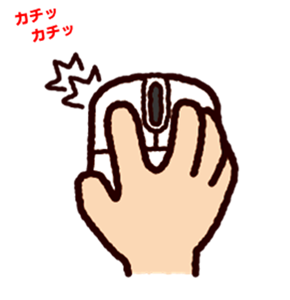

第2章 パソコンの基礎
# 2-8　入力装置の種類

さまざまな種類の入力装置の機能や特長について、また使われ方につい
て学習します。

> ## ● ポインティングデバイス
GUI系のOSで用いられる、画面上の位置情報などを入力する装置のことで、マウスが代表的です。

### (1) マウスの機能
マウスは、マウスパッドとともに用いて、画面上の位置や移動量、移動速度などの情報を入力できます。ボール式と光学式のほか、マウスの変形としてトラックボールなどがあります。

マウスには、1つから3つのボタンがついていて、押すことで画面上のポインタを操作します。

| ボタン       　　| OS |
|-------------|------------|
| 1つ    | MacOSなど |
| 2つ     | Windowsなど |
| 3つ | Unixなど |

### ① ボール式
マウスの中にある球を転がし、その転がりの方向と転がり量から、移動量や方向、移動速度を入力します。

### ② 光学式

底面の**LED**からの光をセンサでスキャンして、微妙な反射率の変化を検出することで、移動量を求めます。
光を利用しているため、ごみが詰まることもなく、水平な机の上でなくても操作ができます。光学式はガラスや光沢のある素材の上では思うように動作しない場合もあり、その欠点を改善した青色LEDやレーザー式マウスが登場しています。

>➤ ポインタ：マウスポインタ、マウスカーソルとも呼ばれます
>
>➤ LED (Light Emitting Diode):
発光する半導体素子

### (2) マウスの操作
### ① クリック

マウスのボタンを一度押す
ことを**クリック**といいます。
ウインドウのメニューやアイコンを選択することができます。

### ② ダブルクリック

マウスのボタンを二度連続
して押すことを**ダブルクリック**といいます。アプリケーションを実行したり、ウインド
サのアイコンを開いたりするときなどに、この操作をします。

### ③ ドラッグ
ウインドウのアイコンをクリックしたまま、マウスを動かすことを**ドラッグ**といいます。アイコンを移動したりコピーするときなどにこの操作をします。

> ## ● そのほかの入力装置

### (1) キーボード
キーを押すことで、その位置に対応した文字、数字、記号の宿号を入力する装置です。

### (2) タッチパネル
パソコンやスマートフォンなどのディスプレイに直接触れることで対応した文字や言号を入力する装置です。

### (3) OCR／OMR／イメージスキャナ
光を照射し、その反射光を光電素子で感知し、デジタル化する装置です。文字や記号を読み取る装置がOCR、シートのマークを読み取る装置がOMR、画像データとして読み込装置がイメージスキャナです。
### (4) コードリーダ
商品などに付けられたバーコードを光学的に読み取る装置です。
### (5) ディジタルカメラ
CCDなどの半導体素子を利用して画像データをディジタル化するカメラです。
### (6) Webカメラ
インターネットに接続されており、リアルタイムで映像を配信することができるカメラです。

> ### この単元のキーワード
>- ポインティングデバイス
>- マウス
>- ボール式
>- 光学式
>- クリック
>- ドラッグ
>- OCR
>- OMR
>- イメージスキャナ
>- ディジタルカメラ
>- webカメラ

➤ OCR (Optical Character
Reader)：印字された文字を読み取る装置

➤ OMR (Optical Mark Reader)：マークシート上の塗りつぶされた箇所を読み取る
装置

➤ JANコード (Japan Article
Number code)：棒状の幅と間隔で商品の識別を行うためのコードで、JISで定められています。ヨーロッパで使用されているEANとは互換性があります。

➤ QRコード：2次元コードで
3隅に四角のマークがあり、一方向からしか読み取れないバーコードと異なり、どの方向からも読み取ることが可能です。なお、QRコードは株式会社デンソーウェーブの登録商標です。

