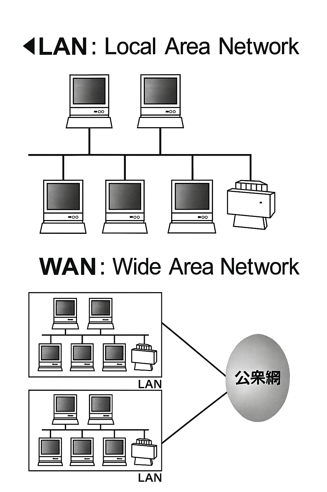
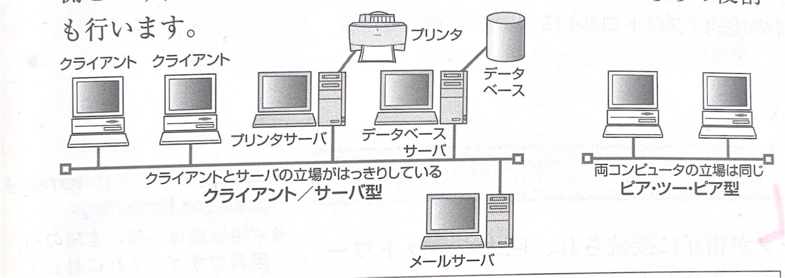

第3章 インターネットの基礎
# 3-1　ネットワークの基礎知識

コンピュータネットワークの種類とネットワーク上でのコンピュータの役割、構成する装置について学習します。

➤ LAN: Local Area Network
62
> # ● コンピュータネットワークとは
コンピュータネットワークは、複数のコンピュータを挨続し、データやハードウェアやソフトウェアを共有することができるように統合し、情報の処理、共有、発言を行うことができます。

> # ● ネットワークの種類
ネットワークの形態は、その規模によりLANとWANに大別されます。

同じ建物や敷地で通を行う小規模なネットワークをLAN
**（構内情報通信網）** といいます。複数のコンピュータや周辺機器を接続したネットワークです。

一方、**WAN
(広域情報通信網)** は、電話網とコンピュータ
ネットワークを続したSBNや、ADSL、CATV、光ファイ
バ網57TH）を崩いて、遊隔地のLAN同士を接続して構築された広域のネットワークです。

世界規模でLANやWANを相互に接続した巨大なコンピュータネットワークをインターネットと呼んでいます。

➤ WAN: Wide Area Network

➤ ISDN (Integrated Services Digital Networ-
K）：総合サービスディジタ
儿通信網

➤ ADSL (Asymmetric
Dig-ital Subscriber
Line）：電話回線を用いて行
う高速のディジタル通備。
ADSLモデムが必要です。

➤ CATV (Cable Televi-
sion）：ケーブルテレビのこ
➤ 光ファイバ（FTTH）：ユーザのコンピュータからプロバイダまでの回線を、光7アイバにより接続する方式。
10Mbps~数100Mbpsの伝送速度になります。通信速度が速く、安定性も高いのが特徴です。

➤ クライアント：client

➤ サーバ：server

> # ●ネットワークの構成とコンピュータの役割
ネットワークの構成には、クライアント／サーバ型とピア・ツー・ピア型があります。

## (1) クライアント／サーバ型
サーバは、ネットワーク上のさまざまな情報サービスを提供するために動作しているコンピュータです。クライアントは、サーバが提供するサービスを利用するコンピュータです。

サーバから提供するネットワークサービスには、プリンタ共有、ファイル共有、データベース、メールサービス、Webサービス、DHCP、DNSなどがあります。

## (2) ピア・ツー・ビア（P2P）型
サーバとクライアントの役割分担は行わず、コンピュータ同土の立場は対等に扱います。サービスを提供する側と利用する側という役割に分かれないで、各コンピュータはどちらの役割も行います。

|    　　|  |
|-------------|------------|
| プリンタサーバ   | クライアントがプリンタを共有できるように、サービスを提供する。 |
| ファイルサーバ    | クライアントからハードディスクなどの記憶装置が共有できるサービスを提供し、ファイルやデータを一元管理する。 |
| データベースサーバ | データベースを一元管理し、クライアントから要求があればデータベースよりデータを引き出し、クライアントに返す。 |
| メールサーバ | クライアントからの要求にもとづき、電子メールの送受信を行う。 |
-----------

> ## ●ネットワークを構成する装置
### ① NIC（LANカード）
コンピュータとネットワークを接続するインタフェースです。

### ② LANケーブル
NICやその他の機器を接続するケーブルです。

### ③ハブ （HUB）
各コンピュータに接続されたケーブルをそれぞれ接続するた
めの集線装置です。

### ④ルータ
異なるネットワークを相互接続するための装置です。

### ⑤無線LAN

LANケーブルの代わりに、電波などを使って接続するLANです。一般家庭で使用するためには、**無線LANアクセスポイント**と呼ばれる基地局を設置する必要があります。また、パソコンには**無線LANアダプタ**を取り付けます。

> ➤ この単元のキーワード
> - LAN
> - WAN
> - クライアント
> - サーバ
> - クライアント／サーバ型
> - ピア・シー・ピア型
> - プリンタサーバ
> - ファイルサーバ
> - データベースサーバ
> - メールサーバ
> - NIC
> - LANケーブル
> - ハブ
> - ルータ
> - 無線LAN

➤ DHCP (Dynamic Host
Configuration Protocol) : ネットワーク上のコンピュータなどにIPアドレスを自動的に割り付けるものです。

➤ DNS (Domain Name System) :
3-2を参照

➤ NIC (Network Interface Card) :
LANアダプタとも呼びます。

➤ MACアドレス：ネットワーク機器が持つ6バイトのアドレスで、他の機器と重複することはありません。

➤ リピータハブ：ハブの1つで、ホストから送られてきたデータを、増幅してそのまま他の端末すべてに送信するもの。

➤ スイッチングハブ：ハブの1
つで、ホストから送られてきたデータを、MACアドレスをもとに判別し、送信先の端末だけにデータを送信するもの。

➤ ブロードバンドルータ：
ADSLやFTTHなどの高速回線に複数のパソコンを接続する機器です。HUB機能や無線LAN機能を持ち、複数のパソコンでブロードバンド回線を共有することができ、また、接続されたパソコンは相互にLANに接続された状態ですので、ファイルやプリンタの共有もできます。

