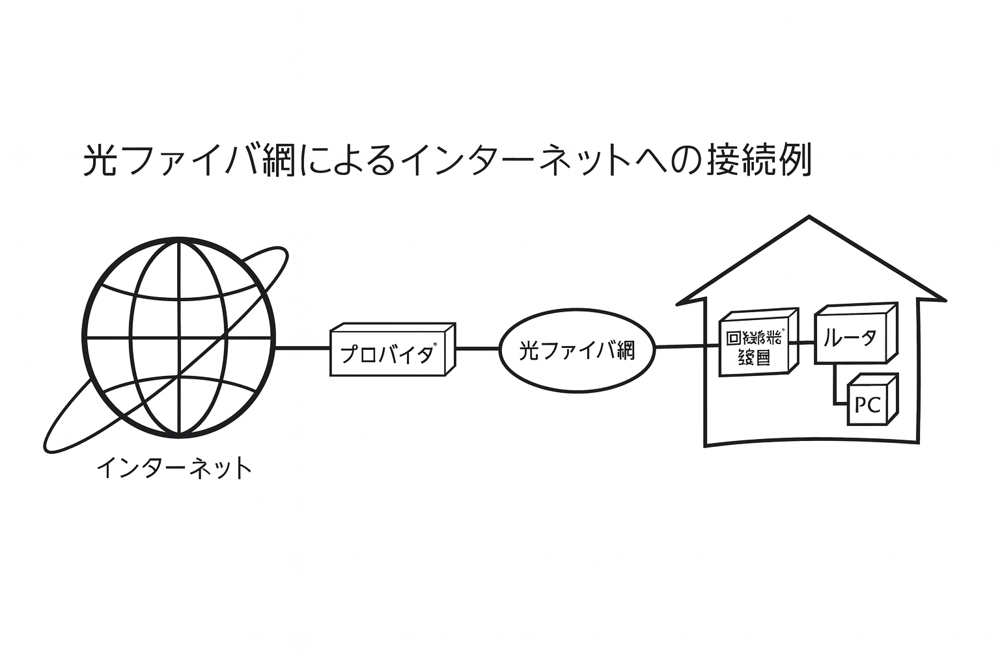
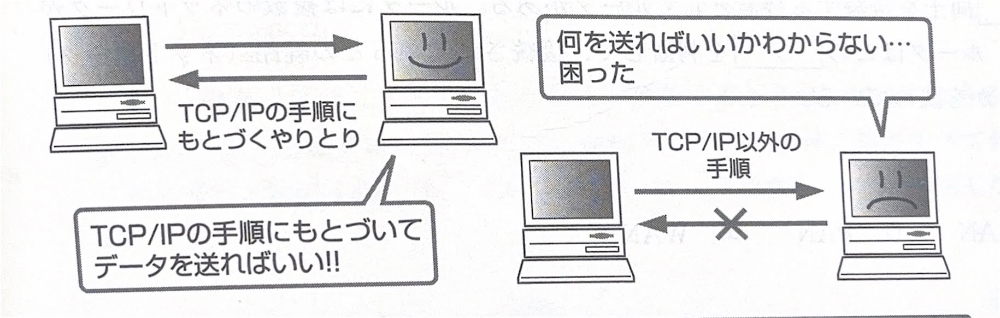

第3章 インターネットの基礎
# 3-2　インターネットの仕組み

インターネット上でデータのやりとりを行う際の仕組みと、データのやりとりの規約（プロトコル）について学習します。

> ## ●インターネット
世界中のコンピュータが相互に接続され、巨大なネットワークの形となって張りめぐらされたものをインターネットといいます。ネットワーク同士をつなぎ合わせてできたネットワークです。インターネットを通して、世界中の情報を収集したり、情報を発したりすることができます。

コンピュータをインターネットに接続するサービスを提供する組織を、プロバイダ（ISP）と呼びます。個人でインターネットを利用する場合、プロバイダと契約を結び、機器の接続設定を行うことで利用できます。ADSLやCATVや光プァイバ結（FTTH）での接続は、「常時接続」が可能です。

➤ プロバイク31SP （Intenet
Services Provider)

➤ 常時接続は一般に定額の利用料ですが、それに対して接続時間の長短によって回線利用料が課金（従量制）
されるダイヤルアップ接続もあります。

➤ ADSL、CATVやFTTHなどは、通信速度1.5～1000Mbps
の高速性からプロードバンド
（broadband）と呼ばれることがあります。対して、従来のダイヤルアップ接続やISDNはせいぜい128kbpsの通信速度で、ナローバンド（narrowband）
と呼ばれます。

➤ WWW: World Wide Web

>## ●インターネットの仕組み

### (1) WWW world wide web
インターネットを通じて情報を共有したり、提供したりすることができるシろえムです。WWwはWebページと呼ばれる電子的な文書を公開します。文章や画像、音声、映像などの情報を1つの画面としてまとめたものがWebページです。複数のWebページが集まったものをWebサイトと呼びます。Webページを閲覧するには、ブラウザと呼ばれるソフトウェアを利用
します。

### (2) TCP /IP

インターネットを利用したネットワークサービスのきまりごとは、TCP／IPプロトコル（通信規約）にもとづいています。
TCP／IPは、TCPと！という2つのプロトめの総称です。
インターネットでの通信は、データを細かく節に、パケットと呼ばれる単位で送受信するというきまりになっています。

インターネット上のコンビュータや機器には、IPアドレスと呼ばれる住所のような識別番号を付けて識別しています。現在のインターネットでは、IPV4と呼ばれ、IPアドレスを4つの
8ビットの数（計32ビット）で表現し、202.247.162.214のような形で示されています。しかし、これは決して人間にとって覚えやすいものではありません。そこで、jimam.co.jpのように、わかりやすいドメイン名を使用します。ドメイン名はDNSを利用することで、『アドレスに変換されています。

## (3) プロトコル
プロトコルとは、データ通信の手順を定めた規約のことです。
コンピュータ同士が通を行うさい、送信側と受信側で一定の基準が必要であり、標準の規約が必要になります。これらの規約のことをプロトコルと呼びます。

> ## ●インターネットのプロトコル

インターネットで使用される代表的なプロトコルについて紹介します。

① PPP.・電話回線を使ってパソコンをインターネット接続する「ダイヤルアップ接続」で利用されるプロトコルで、最初にユーザIDとパスワードによる認証を行います。

② FTP.・コンピュータ間でファイル転送に使用されるプロトコルで、ファイルのアップロードやダウンロードを行うことができます。

③HTTP…HTMLをサーバからクライアントに送受するさいに使用されるプロトコルです。

④ NTP.…・機器が持つ内部の時計を、ネットワーク経由で正しい時刻に同期するためのプロトコルです。

>この単元のキーワード
>- インターネット
>- www
>- Webサイト
>- ブラウザ
>- TCP/IP
>- DNS
>- プロトコル
>- PPP
>- FTP
>- HTTP

➤ TCP/IP : Transmission
Control Protcol/Internet
Protcol

➤ DNS (Domain Name Sys-
tem）： ドメイン名とIPアドレスを相互変換するシステムです。

➤ IPv4 (Internet Protocol
Version 4）： インターネットの普及により、IPアドレスの数が不足すると考えられ、今後は128ビットで構成される新しいIPプロトコルであるIPV6に移行されていくでしょう。

➤ PPP: Point to Point Protocol

➤ FTP: File Transfer Protocol

➤ HTTP: Hyper Text Transfer
Protocol

➤ HTML:4-5 参照

➤ NTP: Network Time
Protocol

