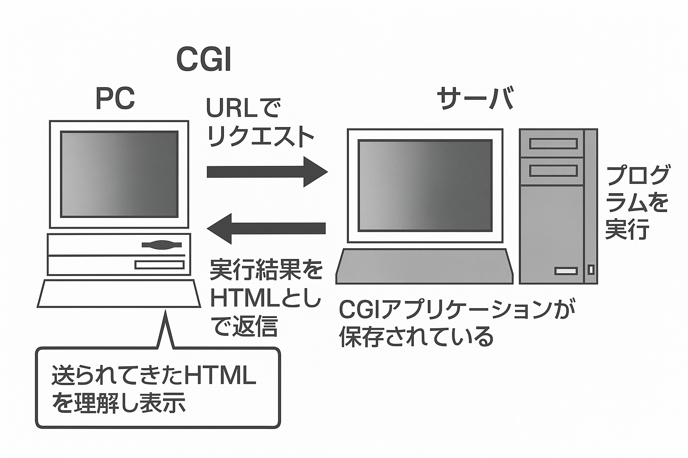
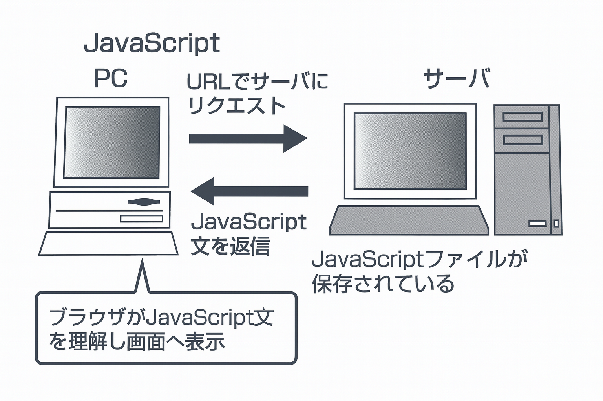

第4章 インターネットの利用
># 4-5　WWWの利用（2）

Webサイトを作成する技術について理解し、WwWでのさまさまな機能
について学習します。

> ● Webサイトの作成の仕組み

Webサイトの作成には、おもに次のような技術を使用します。

### (1) HTML

HTMLは、ホームページを作成するためのテキスト形式の記述言語です。**テキストエディタ**やホームページ作成ソフトを使って、作成および編集ができます。
HTMLは、**タグ**”＜＞”で指示を囲み、記述していきます。
文字の大きさや、センタリングを指定することができます。
また、**リンク**先のWebサイトなどの指定をすると、タグの指定どおりに表示されます。

Webサイトの作成は、次のような手順で行います。

- Webサイトに掲載する文章や画像などのファイルを用意す
る。
- テキストエディタなどにより、HTMLを記述する。
- ファイル拡張子をHTML、HTMなどとして保存する。
- Webサーバへ作成したHTMLファイルを登録（アップロード）する。

また、次のような画像ファイルや動画ファイルなどもWebサイト上に表示できます。タグを使ってHTML上で記述していきます。

➤ HTML: Hyper Text Markup
Language

➤ テキストエディタ：テキストデータを編集するプログラムのことです。

➤ タグ：テキストと区別して画面制をする命令部分のこと。＜）（タグ）で囲まれたかたちで記述されます。

➤ リンク：タグが指定する
URLにジャンプする仕組みのことです。Webサイト上にある文字や画像などに、ほかのWebサイトの場所の情報を埋め込むことができます。このような機能をハイパーリンクといいます。

➤ 圧縮：転送時間の短縮などのために、データ量を圧縮することです。圧縮されたデータをもとのデータに復元する処理を解凍（伸張・展開）といいます。

### ① 画像ファイル
| 種類 | 特徵| 
|---------|------|
| GIF| 256色までの表示が可能であり、画像の輪郭を背景になじませる透過処理ができます。アニメーションも可能です。 |
|    JPG. JPEG    |写真などの色数の多い画像を表現できます。高圧縮されており、完全には元に戻らない非可逆圧縮です。ひかきかくあ。|
| PNG| フルカラーで表示され、透過処理ができます。 |

### ② 動画ファイルや音声ファイル

| 特徵|  種類 |
|---------|------|
| WMV| windowsでのストリーミング配情にも使われる動画ファイルの圧縮形式です。 |
|  MPG. MPEG  |代表的な動画ファイルの圧縮形式です。|
|SWF| アドビシステムズ社のFlashで採用される形式。Webサイトのトップページやゲームなどに使われています。 |
|  MOV |アップルコンピュータ社の QuickTime で使われるファイル形式です。ストリーミング配備にも利用されます。|
| MP3 |音楽CDと同等の音質茶で意高圧の規格です。多くの損帯音楽プレイヤーで利用されています。|

### (2) そのほかの仕組み

HTMLの機能だけでは、伝言板・掲示板や、アンケート入力などはできません。代わりに、あのような仕組みを利用します。

### ① JavaScript

HTMLと同様に、テキストエディタなどで作成することができます。

JavaScriptは、Webサイト上に入力画面を出力したり、入力された数値などを計算したり、簡単なアプリケーションを作成できます。

### ② Java
HTMLやJavaScriptと異なり、専用の開発環境下でプログラムを作成し、クラスファイル化します。このクラスファイルのことを、Javaアプレットと呼びます。

また、Javaはセキュリティやネットワーク機能を強化します。

### ③ CGI
CGIとは、WWWサーバで外部プログラムを利用するためのインタフェースです。Webサイト上で複雑な処理ができます。

ブログなどはCGIを利用しています。ブラウザからWebサイト画面の情報を編集・修正することができ、サーバ上でプログラムが動きます。専用の開発言語（PerlやPHPなど）を用いてプログラムを作成し、アプリケーション化しています。

>➤ この単元のキーワード
>- HTML
>- テキストエディタ
>- リンク
>- タグ
>- 画像ファイル
>- 動画ファイル
>- JavaScript
>- Java
>- CGI

➤ 動画ファイルを表示するためには、ブラウザ側に新規機能を追加するプラグインソフトが必要です。おもに
Flash Player, QuickTime Player, Windows Media
Player, Real Playerがあります。

➤ ストリーミング配：インターネット上で動画や音声を受信しながら再生する技術。ファイルをすべてダウンロードするまで待つ必要はありません。

➤ CGI: Common Gateway
Interface

➤ Perl：強力なテキスト処理が可能であり、幅広い用途で利用されています。

➤ PHP：データベースとの連携に優れているHTML埋め込み型スクリプト言語です。

