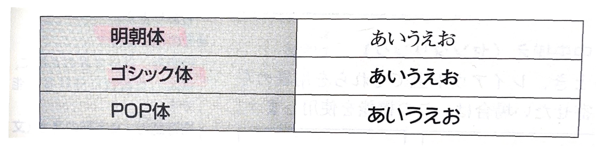
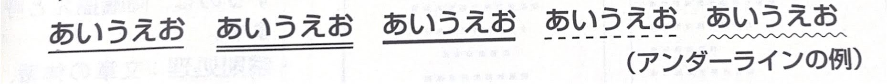
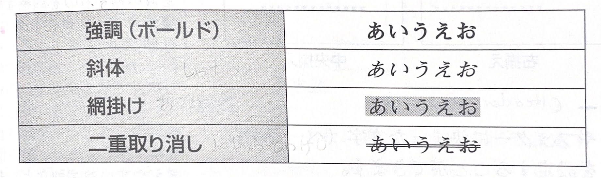
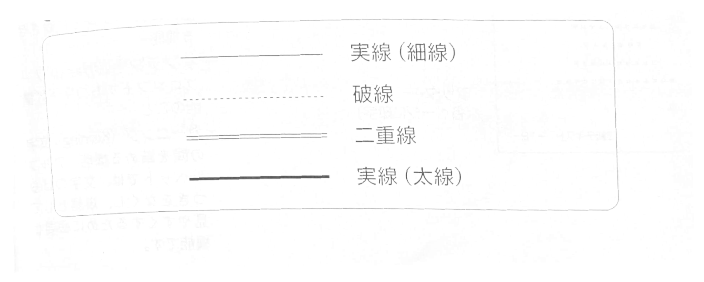

# 第5章 情報機器の基本操作

## 5-4　ワープロソフトの機能と活用（1）

ワープロソフトについての基本的機能や日本語変換の方法などについて理解します。普段使っているワープロソフトを実際に使いながら学習しましょう。

## ● ワープロソフト

ワープロソフトとは、文書を作成するために利用するアプリケーションソフトのことです。一般的には、入力、編集、印刷、保存などのような機能があります。

### （1） 入力機能

キーボードで文字などの入力を行う機能のことです。漢字を入力する場合には、変換を行いますが、これは仮名漢字変換ソフト（FEP）、あるいは **日本語変換システム（IME）** と呼ばれるソフトウェアで行っています。

### ① ローマ字変換

キーボードの英字でローマ字を入力し、変換する方法です。
＜例＞「愛」と変換する場合、A key と I key と入力し変換する。

### ② かな変換

キーボードでかなを入力し、変換する方法です。
＜例＞「愛」と変換する場合、3 key と E key と入力し変換する。

> FEP (Front-End Processor):
仮名漢字変換ソフトの総称。
メインプロセッサの負担を軽減するために、データの前処理を行う装置のことを指す場合もあります。

> IME: Input Method Editor

> クリップボード：複写する
データを一時的に保存しておくためのメモリ領域のこと

> オペレーション：操作

### (2)  編集機能

作成した文章の編集を行う機能です。おもな機能には、次の
-(2O3) R
ようなものがあります。

### ① 複写（コピー＆ペースト）

複写したい文字を選択し、コピー（クリップボードに保存）
後、複写したい場所でペースト（貼り付け）を行います。
多くのソフトウェアでは、コピーを行う場合のショートカットキーは、`Ctrl + C` とオペレーションします。

また、ペーストを行う場合は、`Ctrl + V `とオペレーションします。
このオペレーションでは、コピーした部分の文章はそのまま
残されます。

### ② 移動（カット＆ペースト）

移動したい文字を選択し、カット（切り取り）後、移動したベーストを行う場合は、1ml+四とオペレーションします。

カットを行う場合は、`Ctrl + X `とオペレーションします。
ペーストを行う場合は、`Ctrl + V `とオペレーションします。
このオペレーションでは、カットした部分の文章はなくなります。

### ③文字の書体変更

文字にはさまざまな **フォント**（書体）があるので、その文書の目的やレイアウトなどに合わせて選択します。
代表的な書体には、「朝体」「ゴシック体」「POP体」などがあります。

### ④ 文字修筋

ワープロソフトでは、文字の修飾ができます。下線（アンダーライン）、強調、斜体、絶掛け、三重取り消しなどができます。

これらは組み合わせて使用することもできます。

### ⑤ 罫線

野線を使用し、文章中に表を作成することができます。たくさんの種類の罫線が用意されています。

>この単元のキーワード
>- ワープロソフト
>- 入力機能
>- 仮名漢字変換ソフト
>- 日本語変換システム
>- ローマ字変換
>- かな変換
>- 編集機能
>- 複写
>- クリップボード
>- 移動
>- フォント
>- 文字修飾
>- 罫線

> フォントサイズ：各書体の選択とともに、目的に合わせてフォントサイズも選択します。フォントサイズはポイント数で指定するのでポイント数の変更でサイズを変更できます。

> フォントの変更という場合、書体、フォントサイズ、文字修飾の有無を選んで行います。

> 他の文字修飾（文字飾り）
などには、次のものもあります。
縮小文字（上付き：$2^3$、下付き：O~2~ ）
影付き文字（影付き）
中抜き文字（中抜者）
浮き出し文字（浮き出し）
んどくも
ルビ(難読文字などのフリガナ)
第5章・情報機器の基本操作
情報検定
