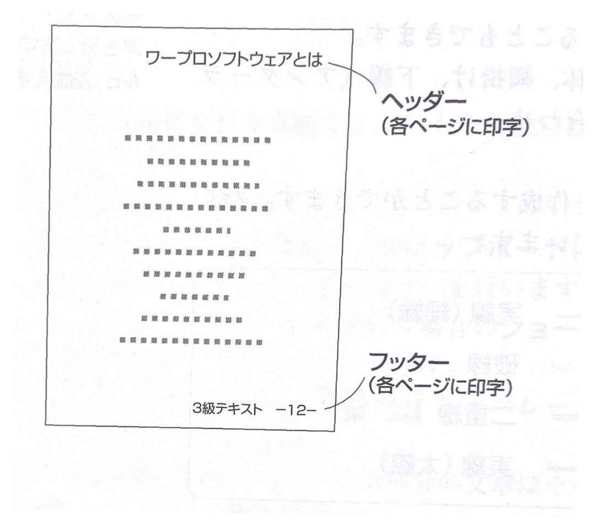
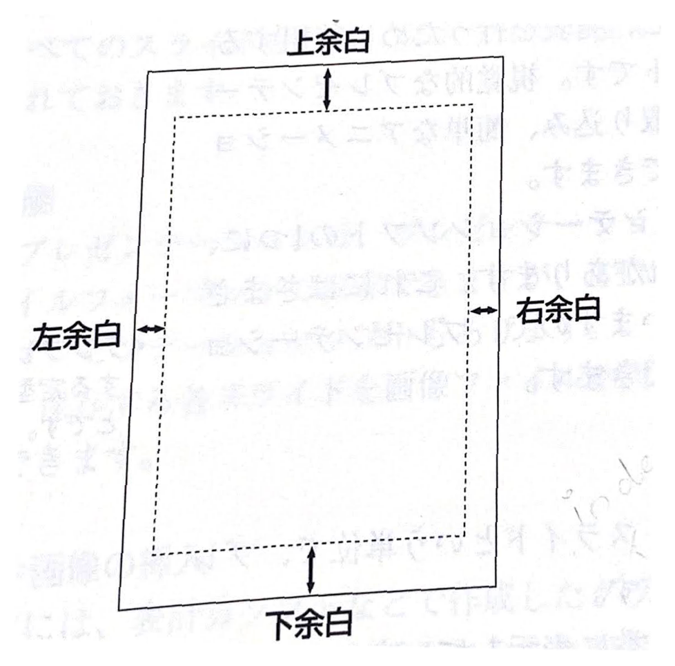

第5章　情報機器の基本操作
# 5-5　ワープロソフトの機能と活用（2）

文章のレイアウトを整えるための機能について学習します。読みやすい文書をつくるためにどのような機能を使用すればよいか、理解しましょう。

> ### ● レイアウトを整えるための機能

#### ① 左揃え、右揃え、中央揃え（センタリング）

文章や表を作成するとき、レイアウト上でそれらを用紙の左や右、あるいは中央に寄せたい場合は、この機能を使用します。

#### ② ヘッダー、フッター
各ページのヘッダーやフッターに決まった文字（ページや日付、ファイル名など）を設定することができます。

>➤ 直感的に、を揃えを左客せ
右揃えを右寄せと呼ぶこと
もあります。

>➤ その他の機能1
・段組み：見やすさのために、指定した段数に分ける機能
です。

>➤ 均等割付：文字列の長さ（
字数）を指定して、文字がいくつあっても間隔を均等
調整して長さを揃える機能です。行全体に均等割付をするのは、両端揃えと呼びます。

>➤ 禁則処理：文章の体裁、見た目の悪いものを調整する機能です。文章の行頭に、行頭禁止文字「。」「、」や「・・・」があると、前の行に押し込んでしまいます。同様に、行末禁止文字（かっこの始まりなど）や分離禁止
文字（行をまたぐと読み間違えやすい数字列など）も調整します。

>➤ ヘッダー：先頭
>➤ フッター：未尾
>➤ その他の機能2

- タブ：ワープロソフトなどで、あらかじめ設定した一定の文字間隔の位置（タブ位置）にカーソルを移動させ
る機能

- インデント （indent）：ワー
プロソフトがもつ字下げ機能のこと

- カーニング （Kerning）：文字の間を詰める機能。アルフアベットでは、文字のばらつきをなくし、単語として見やすくするために必要な機能です。

> ### ●　印刷機能

作成した文章の印刷を行います。さまざまな設定ができます。

### ① 通紙サイズと向きの選択

印刷する用紙サイズを選択することができます。
また、用紙サイズに加え、印刷方向（横向き、縦向き）も選
択できます。

**A3**　297mm x 420mm

**B4**　257mm x 364mm

**A4** 　210mm x297mm

**B5**　182mm x 257mm

### ② 余白の設定

印刷する場合に、上下左右に余白を設定することができます。
個別に設定しない場合は、標準値が設定されています。

> この単元のキーワード
>
>- レイアウト
>- 左揃え
>- 右揃え
>- 中央揃え
>- ヘッダー
>- フッター
>- タブ
>- インデント
>- カーニング
>- 余白

➤ 余白：マージンともいいます。

➤ その他の機能3

検索と置換：指定した文字列を探すのが検索機能で、あわせて別途指定した文字列に置き換えるのが置換機能です。たとえば検索と置換機能によって、文章中の「JAVA」を「Java」に一括して置き換えることができます。

➤ 定型文（テンプレい5）：ワープロソフトには、挨拶文書などよく使われるような文書例があらかじめ準備されています。これらは定型文と呼ばれ、新たに文書を作成するときのひながたとなり、作る労力を軽減できることがあります。

➤ 社外文書と社内文書：企業などで、提案書や依頼状など社外に出す社外文書と、回覧文書や稟議書など社内で用いる社内文書があります。それぞれ各社で蓄積され、標準化された書式や体裁があります。

➤ HTML文書：作成した文書は、通常はワープロソフト
標準のファイル形式で保存されますが、ワープロソフト以外で利用するために、HTML形式で保存することもできます。他にテキスト形式での保存や、他のワープロソフトの標準形式で保存することも可能です。

### ③ 文字数と行数の設定
1ページに書き込む行数や、1行に書き込む文字数を設定することができます。文章の目的や、文字の大きさに合わせて設定を行います。この設定は、文章を作成する前にページ設定や書式設定で決めておいたほうが便利です。すでにある文章の設定を変更すると、レイアウトが崩れてしまうおそれがあります。

### ④字間、行間の設定
文字と文字の間、行と行の間を何ミリにするかが設定できます。あまり詰めすぎてしまうと、文字が重なってしまうことがあります。

### ⑤ 印刷部数の設定
印刷を行うときは、何部印刷を行うかなどの設定ができます。
複数部印刷する場合は、この機能を使用すると便利です。