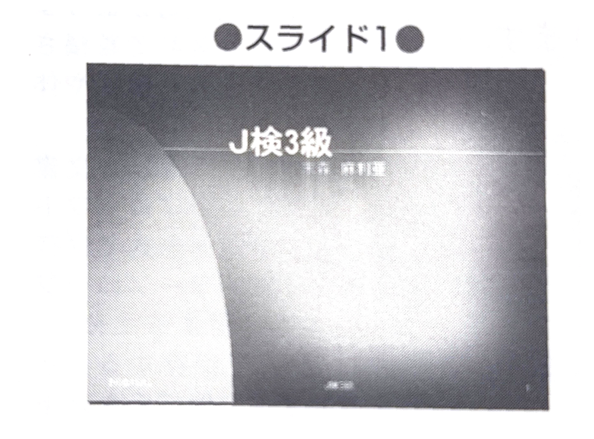
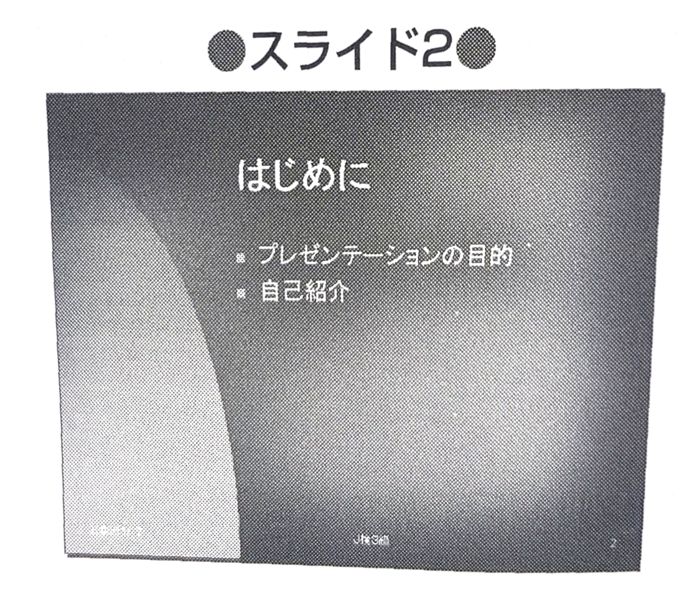
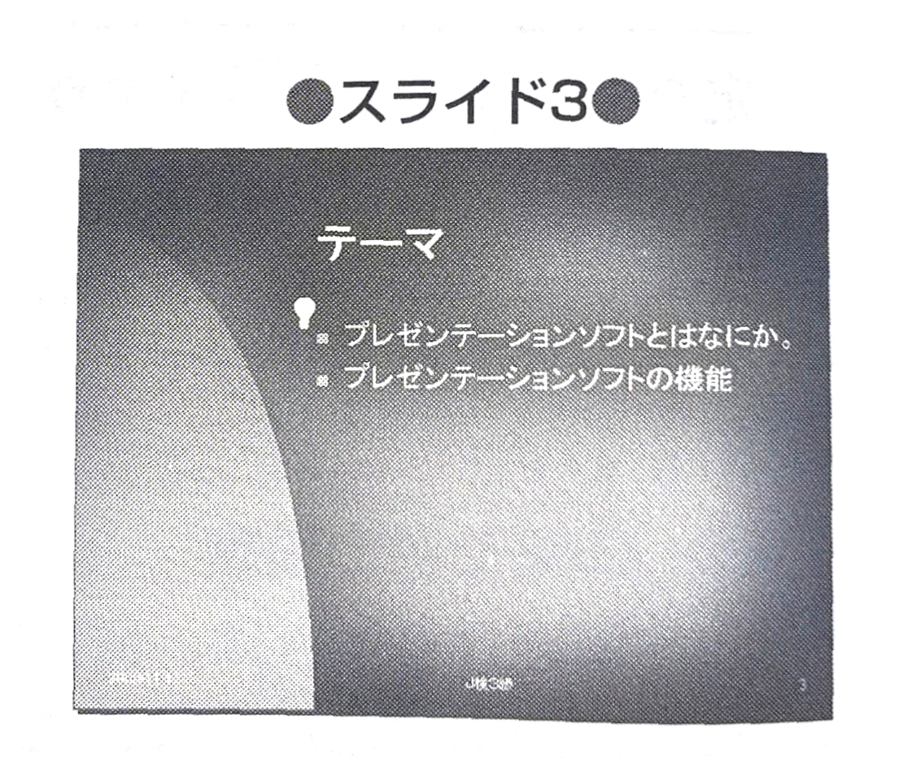
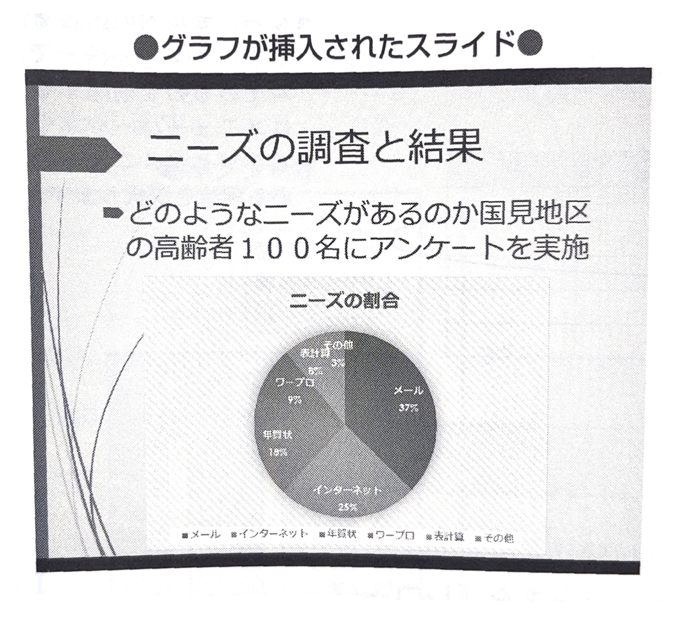
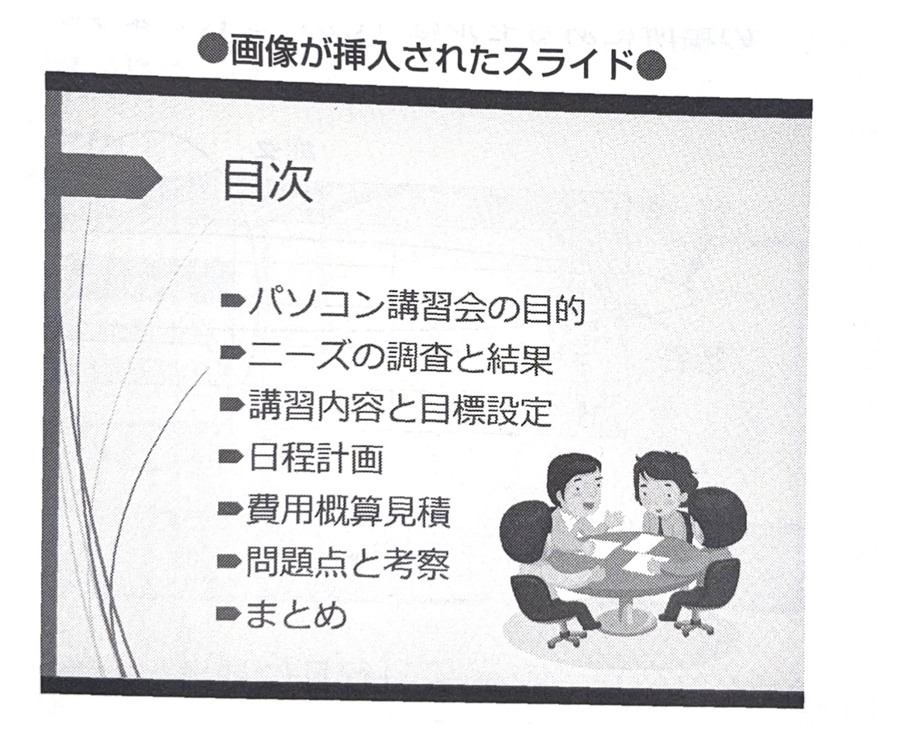

第5草 情報機器の基本操作
# 5-6　プレゼンテーションソフトの機能と活用

プレゼンテーションソフトとその機能について学習します。

> ## ● プレゼンテーションソフト

会議などで、パソコンを利用し、発表を行うために使用するのが、プレゼンテーションソフトです。視覚的なプレゼンテーションができるうえ、グラフの取り込み、簡単なアニメーションの再生、効果音の設定などもできます。

もっともよく使われるプレゼンテーションソフトの1つに、マイクロソフト社のPower Pointがあります。これにはさまざまな **テンプレート** が用意されていますので、プレゼンテーション用資料簡単に作成することができます。

>➤ テンプレート: 頻繁に使用する定型フォーマットのことです。

## (1)  スライドの作成
プレゼンテーションソフトは、スライドという単位で、プレゼンテーション用資料を作成します。
スライドをクリック1つで、順番に表示していき、プレゼンテーションを視覚的なものにします。
スライドを作成するときには、あらかじめ用意されているテンプレートを使用します。テンプレートの内容は、後で変更することもできます。

プレゼンテーションのシナリオは、スライドを作成する前に考えておいたほうがよいでしょう。

## (2) ブレゼンテーションの構

スライドの作成が終了したら、スライド内でのプレゼンテーション構成を検討します。次のような項目を設定することができます。

①テキストのアニメーション効果。

② グラフやアニメーションをどのように表示していくか。

③サウンドをどのタイミングで流していくか。

## (3) スライドの実行
スライドショーにより、次のような方法でスライドを実行し
ます。

## ① 手動による実行
説明を行いながら、手動でスライドを進めていく方法です。
## ② 自動実行
自動ですべてのスライドを順番に表示させる方法です。効果音なども入れておきます。

## (4) 保存機能
作成したプレゼンテーションは、プレゼンテーションソフト独自のファイルフォーマットで保存できますが、HTML形式で保存できるプレゼンテーションソフトもあります。
そのほか、保存する各スライドを画像ファイルやPDF形式としても保存できます。

## (5)  グラフや画像の挿入
各スライドには、表計算ソフトなどで作成したグラフを挿入することができるほか、画像なども挿入することができます。

> この単のキーワード
>
>- プレゼンテーションソフ
ト
>- テンプレート
>- スライド

>➤ イスライドショー：複数のスライドを次から次へと表示すること

>➤ HTML：4-5を参照

>➤ PDF: Portable Document
Format

