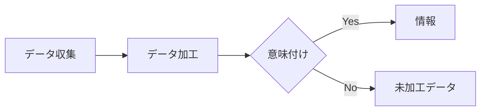

# 7-4　個人情報保護と著作権

# 1-1 情報とデータ

このドキュメントは、Reader 画面でのレンダリング確認用の包括的な Markdown テストデータです。以下に主要な Markdown 機能を網羅しています。

---

## 見出し (Headings)

## H2 見出し

### H3 見出し

#### H4 見出し

##### H5 見出し

###### H6 見出し

---

## 強調 (Emphasis)

- 通常のテキスト
- *イタリック*
- **ボールド**
- ***ボールド＋イタリック***
- ~~取り消し線~~
- インラインコード: `const x = 42;`

---

## 引用 (Blockquote)

> 情報は「意味のあるデータ」であり、データは観測・計測・記録された値です。
>
> - 出典: 架空の教科書

---

## リスト (Lists)

- 箇条書き 1
- 箇条書き 2
  - 入れ子 2-1
  - 入れ子 2-2
    - 入れ子 2-2-1

1. 番号付き 1
2. 番号付き 2
   1. サブ 2-1
   2. サブ 2-2

- [ ] タスクリスト (未完了)
- [x] タスクリスト (完了)

---

## リンクと画像 (Links & Images)

- 外部リンク: [Myan Myan Learn](https://example.com)
- 相対リンク例: `courses/jken/1-2.md` (Reader では直接はリンクしません)
- 画像 (外部):
  
  

- 画像 (ローカル・相対パス):

  

---

## コード (Code)

インライン: `SELECT * FROM data;`

フェンスドコード (言語: javascript)

```javascript
// データの例
const data = [
  { id: 1, name: 'Alice', score: 88 },
  { id: 2, name: 'Bob', score: 76 },
  { id: 3, name: 'Carol', score: 93 },
];

// 平均スコアを計算
const avg = data.reduce((s, x) => s + x.score, 0) / data.length;
console.log('Average:', avg.toFixed(2));
```

フェンスドコード (言語: json)

```json
{
  "id": 1,
  "title": "情報とデータ",
  "values": [0, 1, 1, 2, 3, 5]
}
```

フェンスドコード (言語: sql)

```sql
CREATE TABLE samples (
  id INT PRIMARY KEY,
  label VARCHAR(50),
  value INT
);

INSERT INTO samples (id, label, value) VALUES
  (1, 'A', 10),
  (2, 'B', 20),
  (3, 'C', 30);
```

---

## 表 (Tables)

| 項目 | 説明 | 値 |
|:---|:---|---:|
| A | データ点 | 10 |
| B | データ点 | 20 |
| C | データ点 | 30 |

---

## 区切り線 (Horizontal Rules)

---
---
---

---

## Mermaid ダイアグラム (Diagram)



---

## 定義リスト (Definition List)

用語A
: 説明A（情報の解釈）

用語B
: 説明B（データの前処理）

---

## 脚注 (Footnotes)

サンプル文。脚注の例はこちら[^1]。

[^1]: これは脚注のサンプルです。

---

## 数式（プレーンテキスト例）

- 平均: `μ = (1/n) * Σ x_i`
- 分散: `σ^2 = (1/n) * Σ (x_i - μ)^2`

---

## サブ/上付き・数式レンダリング テスト (Sub/Sup & Math Test)

- サブスクリプト: H~2~O
- 上付き: N^2^
- インライン数式: $E = mc^2$

ブロック数式:

$$
\sum_{i=1}^n i = \frac{n(n+1)}{2}
$$

---

## 参考演習 (Practice)

1. データと情報の違いを自分の言葉で説明してください。
2. 上記の JSON データを編集して、`values` に好きな数列を入れてみましょう。
3. Mermaid のフローを変更して、あなたの処理手順を表現してみましょう。
