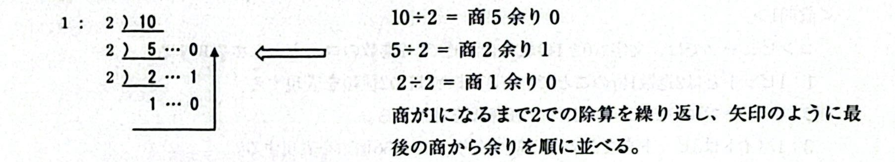

# JKEN Chapter 1 – Question 5 Explanation

## 【解説】

### ＜設問1＞

アナログ信号をディジタル信号に変換する処理を題材にしているが、10進数を2進数に変換する
問題である。

10進数を2進数に変換するときは、2で除算していく。

今回は4桁の2進数で表現するので、(7)10 = (0111)2 となる。

- 2：同様に、(6)₁₀ = (0110)₂ となる。
- 3：同様に、(9)₁₀ = (1001)₂ となる。
- 4：同様に、(13)₁₀ = (1101)₂ となる。

## <設問2>

ディジタル倍号をアナログ信号に変換する処理を題材にしているが、2進数を10進数に変換する問題である。

- 5:2進数···0110    2進数の各桁と、桁の重みの積和で求める。

桁のみ···8421
したがって、0x8+1x4+1x2+0x1=6である。

- 6:同様に、1x8+1x4+1x2+0x1=14である。

## <設間3>

- 7:アナログ信号に対するディジタル信号の利点として、経年劣化が少ないことであるが、複製を繰り返しても劣化しないという利点もある。
