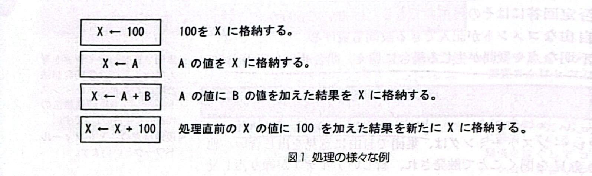
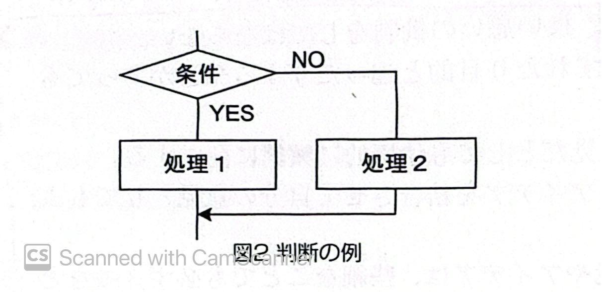
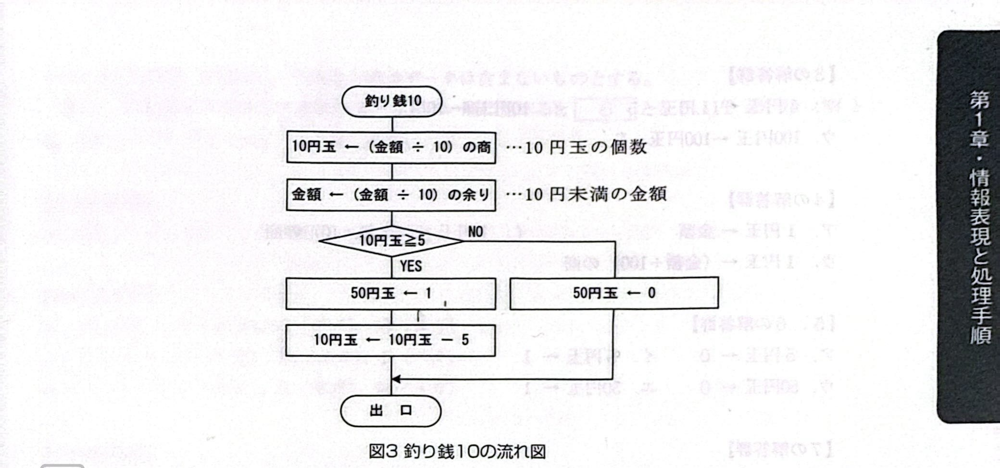
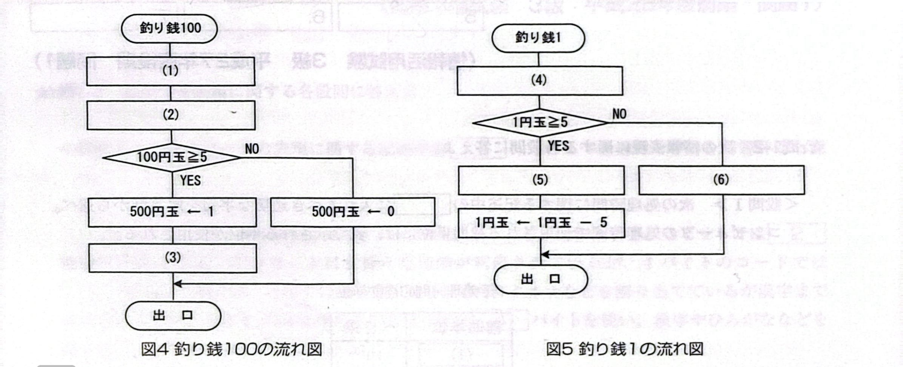

[Chapter - 1, Q - 1]
## 過去問題
# 第1章 情報表現と処理手順
#### ★☆問1-1 次の流れ図に関する記述を読み、設問に答えよ。
問題解決の手順を図で表現したものが流れ図である。流れ図で使用する記号には、次のようなものがある。
処理は長方形で表し、主に代入である。矢印の右側の値や式の結果が、左側の変数に格納される（図1）。

判断はひし形で表し、条件を満たす(YES)か満たさない(No)で、それぞれの線(経路)へ分岐する(図2)

判断の例流れ図は、上から下へ線をたどりながら、処理や判断を実行する。
#### <設問> 次の釣り銭の支払いに関する記述中のに入れるべき適切な字句を解答群から選べ。ただし、除算の小数点以下は切り捨てられる。
流れ図「釣り銭10」(図3)は、商品のおつりとして100円未満の金額を受け取り、10円玉および50円玉の枚数を求め、10円未満の余りを新たな金額とするプログラムである。

同様に、商品のおつりとして1000円未満の金額を受け取り、100円玉および500円玉の枚数を求め、100円未満の余りを新たな金額とするプログラム「釣り銭100」(図4)と、おつりとして10円未满の金額を受け取り、1円玉および5円玉の枚数を求めるプログラム「釣り銭1」(図5)は、次のようになる。

おつりとして1000円未満の金額を受け取り、三つのプログラム「釣り銭1」「釣り銭10」「釣り銭1001を使って、1円玉から500円玉までのすべての金種枚数を求めるには、プログラムを7 の順に実行すればよい。