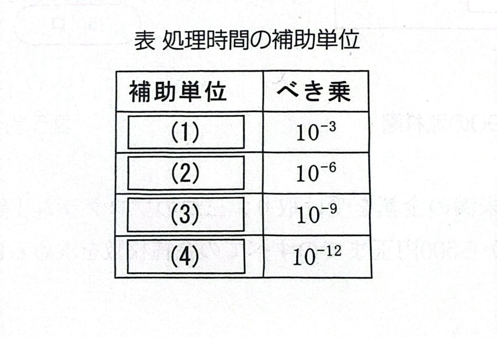

[Chapter - 1, Q - 2]
#### ★☆問1-2 次の情報表現に関する各設問に答えよ。
#### <設問 1>津日野修理時間に関する記述中の1 に入れる適切な字句を解答群から選べ。
コンピューターの修理時間で使用される補助単位には、表で示される単位が使用される。

## <設間2>次の記録容量に関する記述中のに入れるべき適切な字句を解答群から選べ。
ある新聞では、1面(ベージ)当たり平均4万字の記事が書かれている。4G(ギガ)バイトのUSBメモリには、この新聞5 面分を記録できる。ただし、文字コードには2バイトの漢字コ-ド (JISX0208)を使用し、写真など画像データは含まないものとする。
また、記憶容量で使用される補助単位を大きい順に並べると6 となり、1T(テラ)バイトは、1M(メガ)バイトの7 倍である。