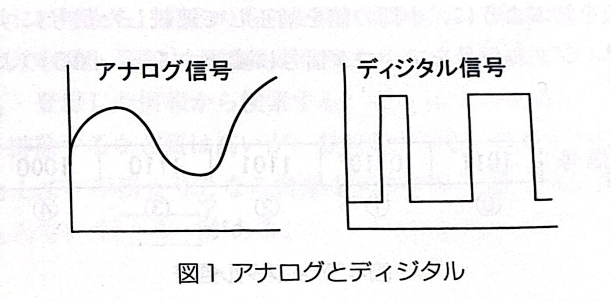
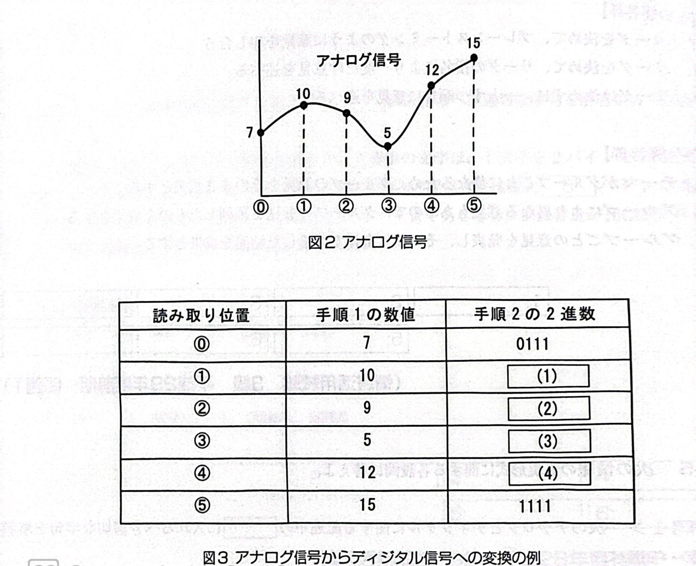

# 問1-5 問1-5次の情報の表現形式に関する各設問に答えよ

## <設問1>次のアナコグとディジタルに関する記述中の【　】 に入れるべき適切な字句を解答群から選べ

図1に示すように、アナログは、人間の声や楽器などの音のように、連続した変化をそのまま表現したもので、ディジタルは、不連続に表現したものである。0と1だけで表現されるコンピュータで扱うデータは、すべてディジタルである。

次の手順1と手順2により、アナログ信号を、コンピパュータで扱えるディジタル信号に変換することができる。なお、ここではアナログ信号の値を4桁の2進数にすることでディジタル信号に変換する。

- 手順1:一定時間間隔でアナログ信号の値を読み取り、整数に数値化する。
- 手順2:手順1の整数値を、4桁の2進数に符号化する。

例えば、図2のアナログ信号をディジタル信号に変換すると、図3のようになる。

手順2の2進数を①~⑤まで順に並べたものがディジタル信号となる。また、ディジタル信号をアナログ信号に変換するには、逆の手順で行う。

- 手順1ディジタル信号を、4ビットずつの2進数にして、数値化する。
- 手順2各数值を結ぶように、中間の値を補正して連続した信号にする。

例えば、図4のディジタル信号をアナログ信号に変換すると、図5のようになる。

