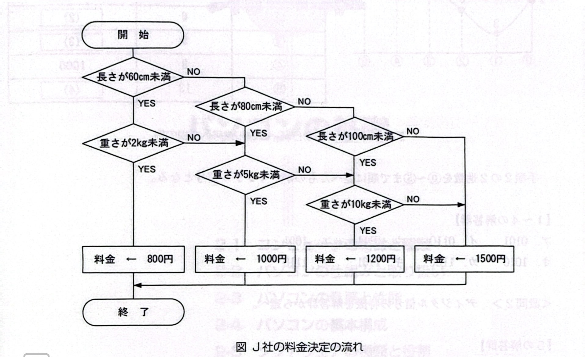

# 問1-7 次の問題解決に関する各設問に答えよ

## <設問1>次の問題解決の方法に関する記述中の入れるべき適切な字句を解答群から選べ

日常生活の様々な問題を解決するために、多様な情報源から目的に応じた情報を検索し収集する。情報の収集方法には、新聞·テレビ·インターネット·図書館の利用の他に、あらかじめ用意した質問用紙に多数の人に回答してもらい、それを集計·分析する【1】 や、調査したい事柄を知る関係者に面接形式で質問し、答えてもらう【2】 などがある。
問題を解決するために組み立てた処理手順を【3】 と呼び、その表記方法のーつに、日本工業規格が定めた図記号を用いる【4】 がある。

### <設間2> 次の問題解決に関する記述中の【　】 に入れるべき適切な字句を解答群から選べ

宅配業者の」社は、宅配する荷物の長さ(縦、横、高さの合計)と重さにより料金を設定している。図に、料金決定の流れを示す。
図から、長さが50cmで重さが4kgの荷物の料金は【5】 であり、長さが90cmで重さが8kgの荷物の料金は【6】 である。

