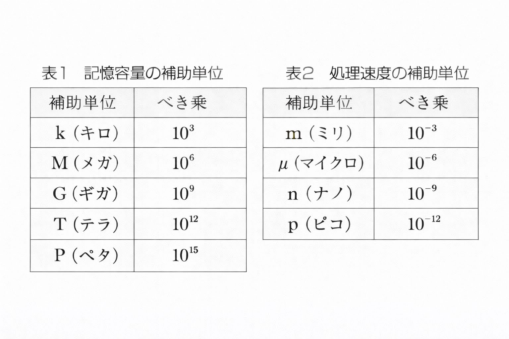

# JKEN Chapter 2 – Question 4 Explanation

問2-4

（情報活用試験 3級 平成29年度前期問題2）

【解説】

## 設問1

1、2：コンピュータ内部で扱う最小単位をビットと呼び、ビットが8個集まったものをバイトと呼ぶ。
1バイトで、2=256種類のデータを表現できる。

3～6：主な補助単位は次表の通りである。

## 設問2

7: $10^9$バイトのファイルをデータ転送速度が10Mバイト／秒でSDカードに転送する場合、$10^9$バイト÷10Mバイト／秒=$10^9$バイト÷$（10×10^6$バイト／秒）=$10^2$秒となり、100秒かかる。
