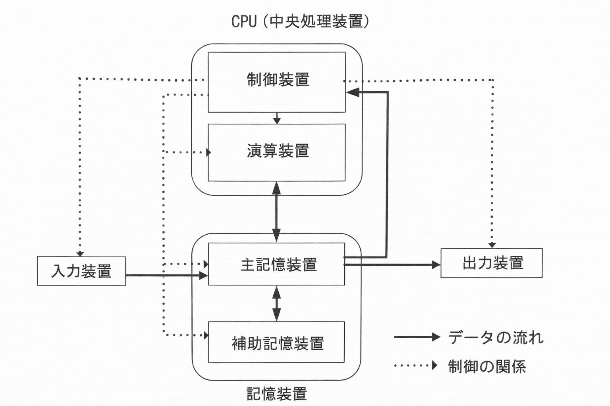

# JKEN Chapter 2 – Question 5 Explanation

【解説】

## 設問1

1~6：ハードウェアは、パソコンの基本機能に対応する装置をもち、それらは五大装置と呼ばれ
次図の構造となる。

## 設問2

ソフトウェアは、パソコンを利用するために必要なプログラムで構成されており、基本ソフトウェアとミドルウェア、アプリケーションソフトウェアに分類されている。

7：ハードウェアの機能を効率的に活用し、ハードウェアとアプリケーションソフトウェアの作業が効率よく行えるように仲立ちをするのは、基本ソフトウェアである。

8: OS上で動作し、複数のアプリケーションソフトウェアで使用する共通機能の提供や、ハードウェアやOSの差異を吸収する機能などを持っているのは、ミドルウェアである。
