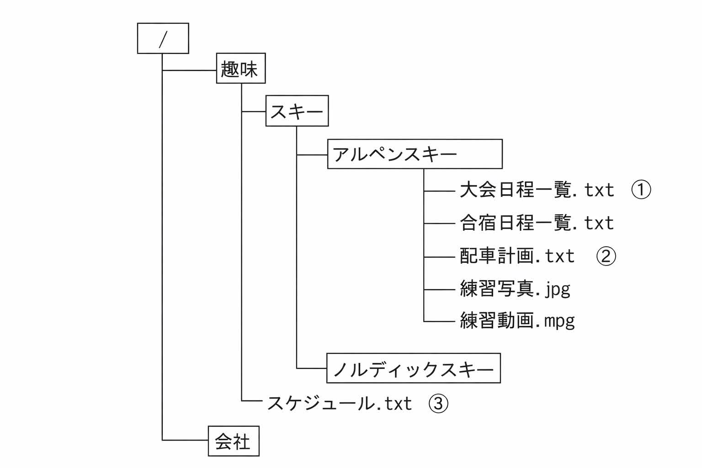

# JKEN Chapter 2 – Question 8 Explanation

【解説】

## 設問1

1：メモ帳で作成した文字だけのテキストファイルの拡張子は、1xLである。
2：データ間を”（カンマ）で区切ったテキストファイルの拡張子は、CSVである。
3：デジタルカメラの写真データなどの画像ファイルの拡張子は、jpegである。

4:HTMLのルールで記述されたWebページなどのファイルの城張子は、htmlである。

## 設問2

フォルダの異なるファイルを特定するときは、パスで指定する。パスの指定方法には、現状のフ
オルダ（カレントフォルダ）を起点に指定する相対パスとルートディレクトリを起点に指定する絶対パスがある。

5：カレントフォルダが“ノルディックスキー”のとき、②のファイルを相対パスで指定すると、
../アルペンスキー／配車計画.txtとなる。

6：③のファイルを絶対パスで指定すると、／趣味／スケジュール.txtとなる。

7：カレントフォルダが“ノルディックスキー”のとき、③のファイルを相対パスで指定すると../../スケジュール.txtとなる。
