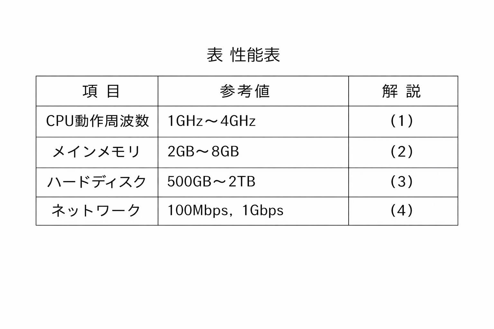

[Chapter - 2, Q - 1]

★問2-1 次のパソコンの性能に関する記述を読み、各設問に答えよ。

パソコンの高性能化は、とどまるところを知らないかのように進んでいる。表は、パソコンのカタログに書かれている性能表のうち、おもな項目についての説明である。

  

  ＜設問2＞ 次のCPU動作周波数に関する記述中のに入れるべき適切な字句を解答群から
選べ。

パソコンでは一般に、各装置の動作のタイミングを合わせるため、周期的な信号（クロックという）を発生させ同期をとっている。CPU動作周波数とは、1秒間に発生するクロックの数のことであり、Hz （ヘルツ）という単位で表す。クロック周波数とも呼ばれる。例えばクロック周波数が1GHzであれば、1秒間に10（1,000.000.000）回のクロックを発生するので、1命令あたり1クロックで動作するとすれば1秒間で5命令の実行が可能であり、1命令あたり1/1,000,000.000秒（1ナノ秒）で実行できることになる。

CPU動作周波数が2GHzであれば、1クロックあたり6かかる。このCPUでは、平均すると、
機械語の1命令あたり4クロックで動作するとすれば、1秒間で7
命令実行できる。

