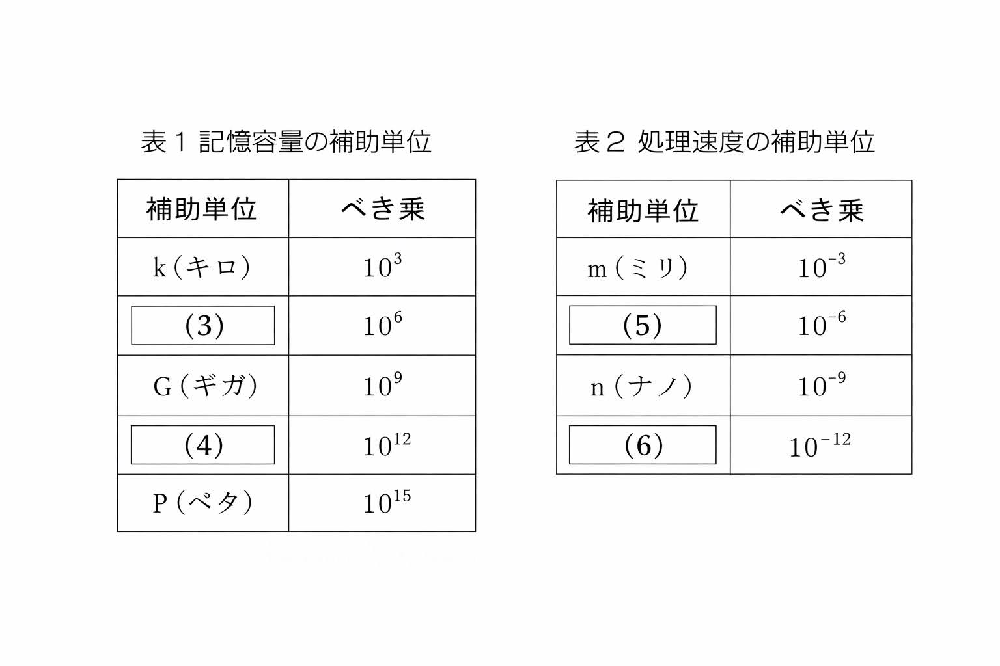

# 問2-4 次の情報表現に関する各設問に答えよ

## 設問1 次の情報の補助単位に関する記述中の［

コに入れるべき適切な字句を解答群から
選べ。

コンピュータの内部では、一般に電圧が有る状態と無い状態で情報を表している。この情報表現は0と1のみで表現される2進数とみなすことができ、この1桁の単位は情報の最小単位で  【1】と呼ばれる。さらに、この情報の最小単位を8桁集めて一つの単位としたものは_  【2】であり、256種類のデータを表現することができる。なお、コンピュータの性能を表現する場合に、数値が大きくなることがあるため、補助単位を用いる。

記憶容量では表1のような大きい数値を補助する単位が、処理速度では表2のような小さい数値を補助する単位が利用される。
  

## 設問2 次のデータ転送時間に関する記述中の

に入れるべき適切な字句を解答群から
選べ。

データ転送速度が10Mバイト／秒のSDカードに、10°バイトのファイルを転送するとき、転送に
およそ
  【7】秒かかる。
