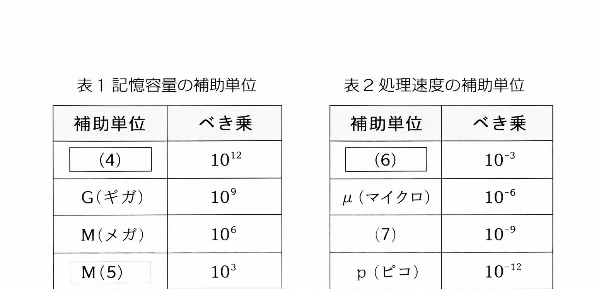

# 問2-6 次の情報表現に関する各設問に答えよ

## 設問1 次の情報の補助単位に関する記述中の  【　】に入れるべき適な学句を解答から選べ。

コンピュータで扱う情報の最小単位を  【1】と呼ぶ。この 【1】を8個で表現した単位を
【2】と呼び、最大【3】種類のデータを表現することができる。

コンビュータでは、記憶容量の大容量化や、処理速度の高速化が進んでいることから、補助系をを用いて表現する。記憶容量では表1のような大きい値を補助する事位が、処理速度ではきての
ような小さい数値を補助する単位が利用される。

  

## 設問2 次のCPUの処理速度に関する記述中の【1】

に入れるべき適切な宇句を解答群から選べ。

クロック周波数が2GHzのCPUは、クロック信号を1秒間に210回発館するので、クロック発信間隔は0.5【8】秒となる。また、このCPUを利用して1000000命令で構成されているサブプログラムを実行するために必要な時間は5【9】秒となる。なお、1命令を1クロックで処理するこ
ととする。
