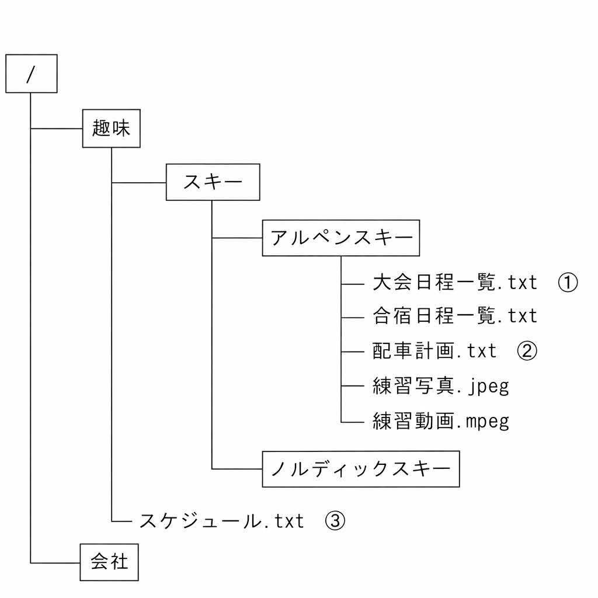

# 問2-8次のファイル管理に関する各設問に答えよ

## 設問1 次の拡張子に関する記述中の【　】

に入れるべき適切な字句を解答群から選べ。

コンピュータ内部では、ソフトウェア資源はファイル単位で記録され管理されている。記憶装置
上の数多くのファイルやフォルダをどのように記憶・管理するかを指定する方式をファイルシステムという。

ファイル名は、ファイルの内容が理解しやすいように名前を付けることで、ファイルの管理がしやすくなる。Windowsでは、ファイル名を次の形式で表す。

＜形式＞ファイル識別名．拡張子

ファイル識別名の"."（ドット）の後にはファイルの種類を表すために拡張子が付けられる。例えば、Windowsでは、メモ帳で作成した文字だけのテキストファイルは【1】
データ間を ","（カ
シマ）で区切ったテキストファイルは【2】］、デジタルカメラの写真データの画後ファイルは【3】,HTMLのルールで記述されたWebページなどのファイルは【4】が拡張子となる。拡張

子は、アプリケーションソフトと対応していることが多く、拡張子を変更するとアプリケーションソフトとの関連付けが切れてしまい、ファイルをダブルクリックしても適切なアプリケーションソフトが起動されなくなることがあるため、むやみに拡張子を変更してはならない。

## 設問2 次のパスの指定に関する記述中の【　】に入れるべき適切な字句を解答群から選べ。

*ファイルシるる台は、ファイルとフォルダから構成され、図のような時間的な構造で管理する。
階層のうち最上位にあるフォルダ（【/】）をルートフォルダと呼び、その下位のフォルダをサプフオルダという。現在作業を行っているフォルダはカレントフォルダという。

目的のファイルを検索するための経路バスといい、ルートフォルダからの経路を絶対パス、カレントフォルダからの経路を相対パスという。フォルダやファイルの区切りは「/」で表し、親（一つ上位の）フォルダは「..」で表す。

例えば、カレントフォルダが“スキー”のとき、①のファイルは、絶対バスでは”趣味／スキー
/アルペンスキー／大会日程一覧,txt"となり、相対パスでは“アルペンスキー／大会日程一覧.txt”となる。］

  

カレントフォルダが “ノルディックスキー”のとき②のファイルは相対パスで【5】と指定でき、③のファイルは絶対パスで【6】、相対パスで【7】と指定できる。
