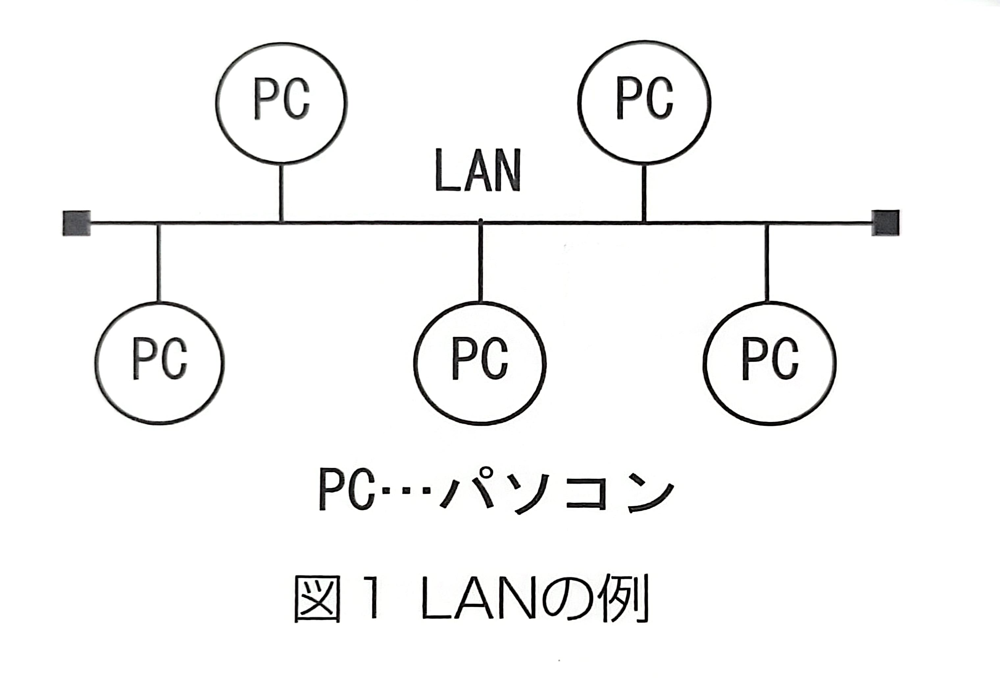
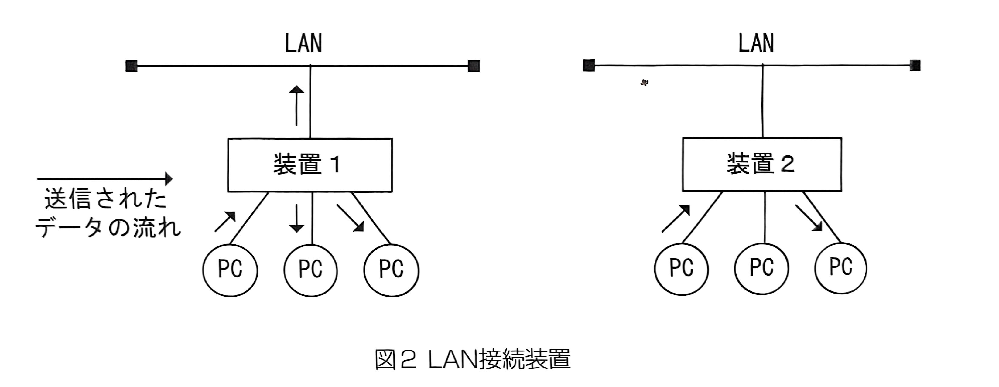
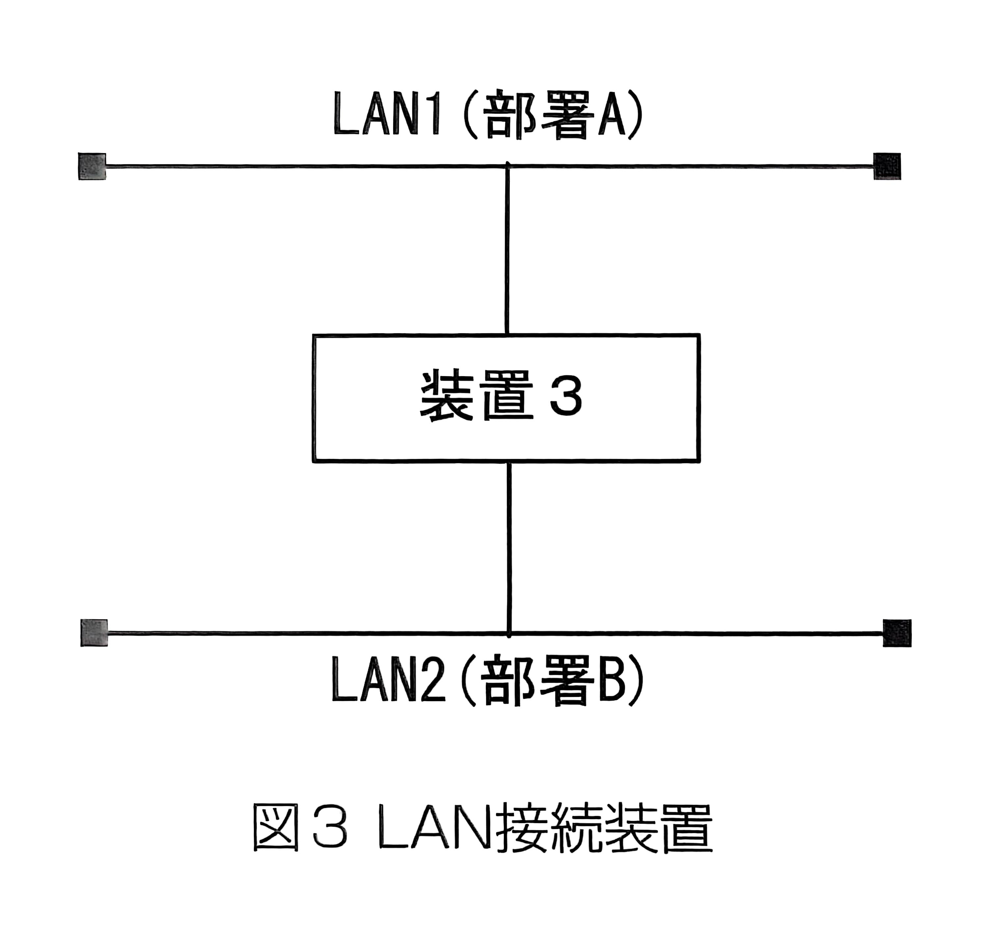
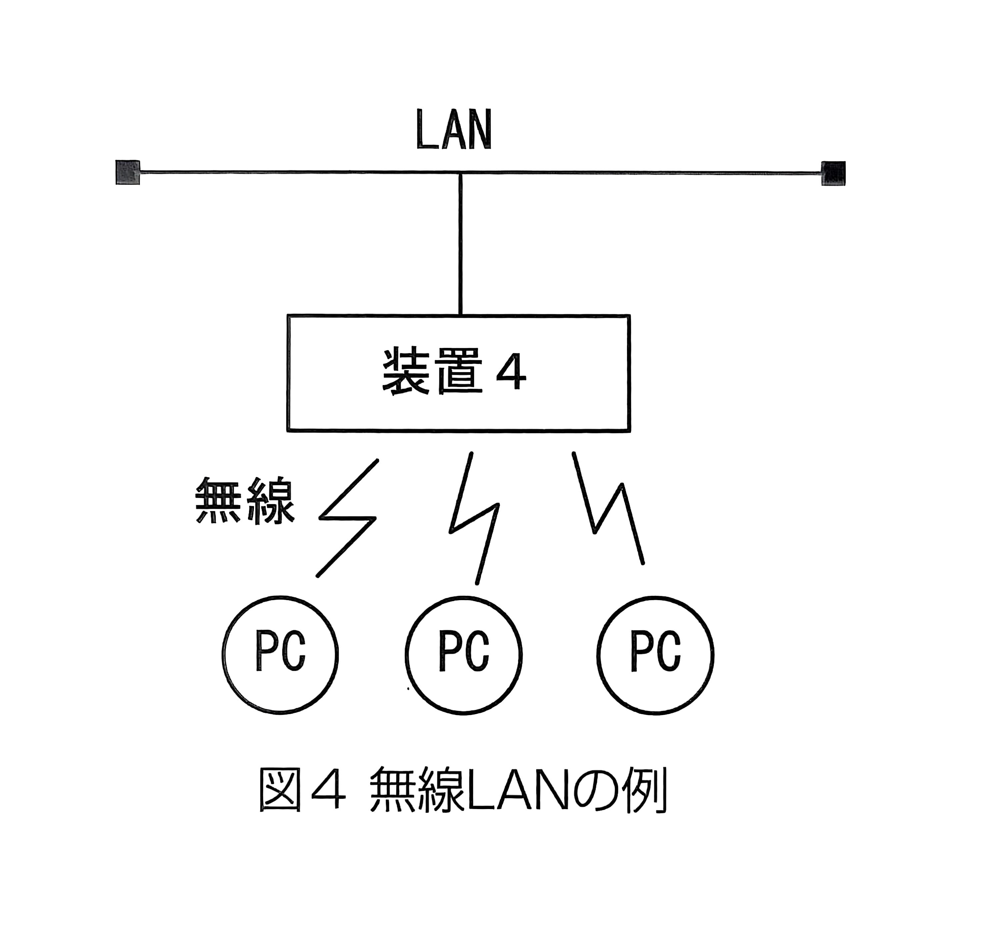

# 次のネットワークを構成する装置に関する記述中の[]に入れるべき適切な字句を解答群から選べ

---

- 
会社内の複数のパソコン間で通信するために LAN を構築する。複数あるパソコンのうち、どのパソコン宛に通信するのかを区別するために、各パソコンに異なるアドレスが必要になる。通常、パソコンを LAN に接続するには、パソコン内にある 【1】 と呼ばれる拡張カードに LAN ケーブルを接続する。この 【1】 には、【2】 と呼ばれる固有のアドレスが付けられている。しかし、【2】 は 【1】 製造時に、48 ビットの 2 進数で ROM に記録されるため、各パソコンのアドレスが分かりづらい。そこで LAN 構築後に、このパソコンは 1 番、このパソコンは 2 番というように、人間が管理して各パソコンに後から付与するアドレスが 【3】 である。もちろん 1 番 2 番という単純なものではないが、ネットワークを構築する側の意図をもって割り当てられる。図 1 のような LAN で、データの送信が行われると通信路上にデータは流れるが、各パソコンはアドレスにより自分宛か否かを判断して、正しい受け手だけがデータを取り込むことになる。

- 
また、複数のパソコンをまとめて LAN に接続するときは、図 2 のような装置が使用される。装置 1 は 【4】 と呼ばれ、1 台の PC から送信されたデータは、他のすべての PC や LAN に送られる。これに対して装置 2 は 【5】 と呼ばれ、【2】 を判断して、特定の PC だけにデータを送ることができる。

- 
さらに、図 3 の装置 3 のように部署ごとに LAN1、LAN2 と割り当てて、部署内の PC 同士の通信が他の部署に流れないようにする機能を持つ装置は 【6】 と呼ばれ、【3】 を利用した経路選択の機能を持っている。

- 
また、図 4 のように、ケーブルを使わず、無線で LAN に接続することもできる。このときの装置 4 は 【7】 と呼ばれている。

---
