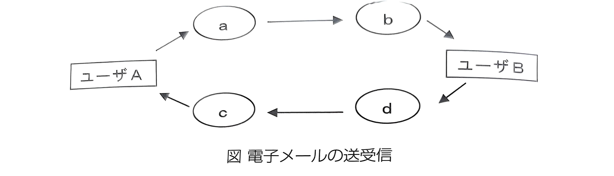

# 第4章 解説6

| No.   | Term (用語)      | Definition (解説)                                                                                   |
| :---- | :--------------- | :-------------------------------------------------------------------------------------------------- |
| **1** | **メーラ**       | 電子メールの作成、送信、受信、管理を行うためのソフトウェア（メールソフト）。                        |
| **2** | **SMTPサーバ**   | 電子メールを送信するためのサーバ。送信元から受信側のサーバへメールを配送する役割を持つ。            |
| **3** | **POP3サーバ**   | 電子メールを受信するためのサーバ。メールサーバに届いたメールを自分のパソコン等にダウンロードする。  |
| **4** | **メールサーバ** | 電子メールを管理・保管するコンピュータ。送信用のSMTPと受信用のPOP（またはIMAP）が連携して動作する。 |
| **5** | **送信経路**     | メーラからSMTPサーバ、そして相手の受信サーバへとバケツリレーのようにメールが運ばれる仕組み。        |

| No.   | Term (用語)    | Definition (解説)                                                                                          |
| :---- | :------------- | :--------------------------------------------------------------------------------------------------------- |
| **6** | **宛先（TO）** | メールの本来の送信先。受信者全員に他の受信者のアドレスが表示される。                                       |
| **7** | **CC**         | 「カーボンコピー」の略。参考として送る相手を指定する。受信者全員に他の受信者のアドレスが表示される。       |
| **8** | **BCC**        | 「ブラインドカーボンコピー」の略。他の受信者にアドレスを知られずに同じ内容を送信できる。受信者には非表示。 |
