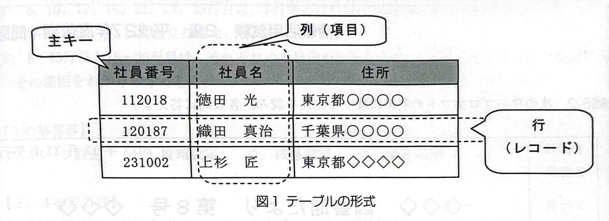
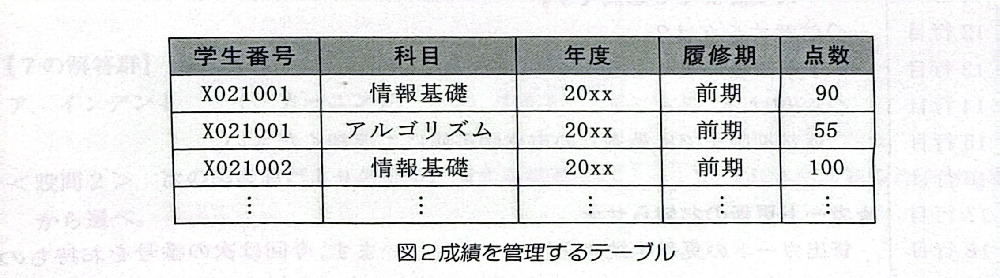

# 問5-1 次のアプリケーションソフトに関する各設問に答えよ

## <設問1> 次の各作業を行う場合に使用するアプリケーションソフトとして適切なものを解答群から選べ

### (1)

- パッコンをコンビュータウイルスから保護する。
- 外部からパソコンヘ不正に侵入させない。
- パソコンに保存されている情報を流出させない。

### (2)

- 大きな会場でプロジェクタを使い研究内容を発表する。
- 就職セミナー会場で自社の紹介をスライド形式で提示する。
- 大学のサークル活動紹介で写真をアニメーンで動かしながら提示する。

### (3)

- 商品の売上数の推移をグラフ化する。
- サークル活動費の収支を管理する。
- 観測したデータを使って様々な関数を利用した分析をする。

### (4)

- システムの仕様手引書を作成する。
- 顧客住所録ファイルから顧客名を取り出して文書に差し込んで印刷する。- 原稿用紙の形式で文章をスカする。

### (5)

- 画像のサイズを小さくしてサムネイル画像を作成する。
- 画像の色調を変更してセピア調にする。
- 画像に映っている人の顔にモザイク加工をする。

### <設間2> 次のデータベースに関する記述中の【　】 に入れるべき適切な字句を解答群から選べ

データベースは、大量のデータを効率的に利用できるような手段を提供するもので、カード型やどがあれている。階層型、リレーショナル型などがある。今日では、リレーショナル型が多く利用されている。

リレーショナル型のデータベースでは、テープル(表)でデータが管理され、複数の表を連係してデータをアクセスする。

テープルは複数の列と行で構成する。社員番号を主キーに指定すると、社具番号の値が重複した行は追加できなくなる。例えば、図1では社具番号として 【112018】を持つ行を追加登録することはできない。複数の項目で主キーを構成することも可能であり、指定した全ての項目の内容が重複しない限り行の追加は可能である。

ここで、学生の成績を管理する目的で図2のようなテープルを作成した場合を考える。ただし、同じ学生番号を持つ学生は存在せず、1人の学生が履修する科目は重複しないものとする(例えば:X021001の学生が履修する情報基礎は1つしか存在しない)。

学生番号だけを主キーとすると、学生1人に対して1科目の成績しか格納できなくなってしまう。【6】 を主キーに追加することで、学生1人に対して複数科目の成績が格納できるよう月心になる。
なお、リレーショルテータベースを利用するにはSQLと呼ばれる言語を使用する。SQLでは、行の挿入をするには【7】 、列の内容を変更するには【8】 という命令を使う。
