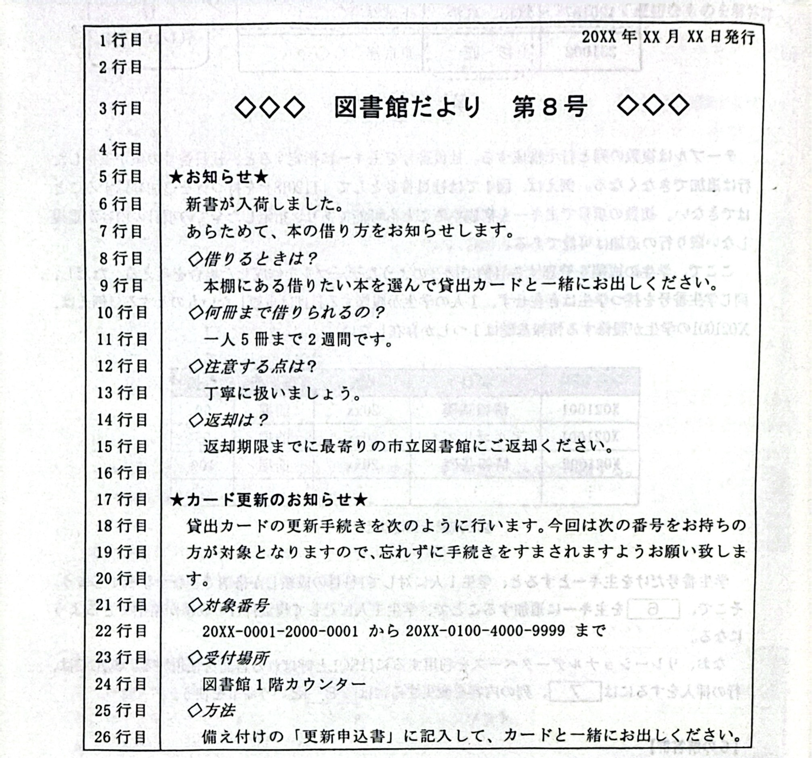
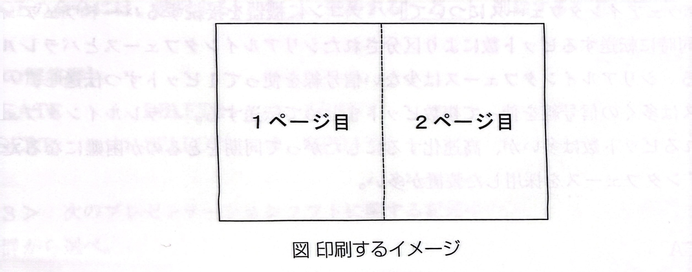

# 問5-2 次のワープロソフトの利用に関する記述を読み、各設問に答えよ

## <設間1>次の図書館だよりを作成する手順を示した記述中の【　】 に入れるべき適切な字句を解答群から選べ

- ① 用紙サイズをA4とし、1ページ30行で【1】 を行い、文章を入カした。
- ② 1行目は【2】 をした。
- ③ 3行目はタイトルとして目立たせるため【3】 を大きくし、【4】 をした。また、フォントを【5】 にした。
- ④ 5行目と17行目の項目を目立たせるためフォント【5】 にした。
- ⑤ 8、10、12、14、21、23、25行日は、5行目と17行目の項目内においける幅項目なので、これらは文字を【6】 にして目立たせた。
- ⑥ 6~15行目と18~26行目は、それそれの項目内の記述なので、【1】 を付けて左に余白を入れ、その範囲をわかりやすくした。

### <設間2>次の図書館だよりの変更に関する記述中の【　】 に入れるべき適切な字句を解答群から選べ

図書館だよりの内容を追加することになり、全部で2ページになった。1ページの大きさを変更せず、下図のように見開きで用紙の片面に印刷することにした場合、用紙サイズは【8】 になる。

