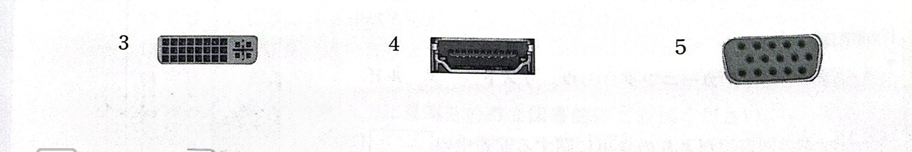

# 問5-3 次の情報機器に関する各設問に答えよ

## <設間1>　パソコンに記載されていた次のアイコン位置のコネクタへ接続するケーブルを解答群から選べ

### <設間2>パソコンとディスプレイと接続する次のコネクタの名称をを解答群から選べ

### <設問3> 次のハードウェアィンタフェースに関する記述を読み、各インタフェースの規格がシリアルインタフェースであれば「ア」、パラレルインタフェースであれば「イ」を答えよ

 [ハードウェアインタフェースについて]バソコンに機器を接続するハードウェアインタフェースには、同時に転送するビット数により区分されたシリアルインタフェースとバラレルインタフェースがある。シリアルインタフェースは少ない信号線を使って1ビットずつ伝送し、パラレルインタフェースは多くの信号線を使って複数ビットまとめて伝送する。パラレルインタフェースの方が一度に送れるビット数は多いが、高速化するにしたがって同期をとるのが困難になるため、最近はシリアルインタフェースを採用した装置が多い。
