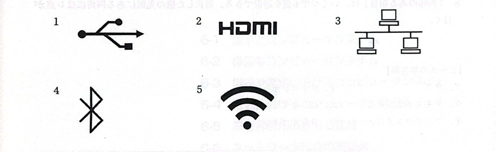
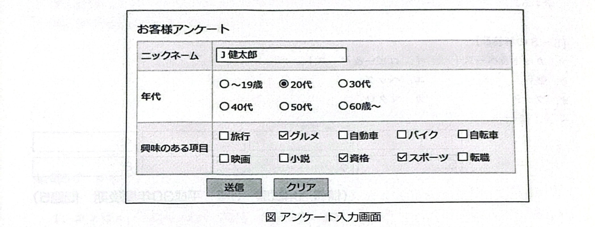

# 問5-8 次のインタフースとそのアイコンに関する各設問に答えよ

## <設問1> 次のコンピュータ操作と関連するアイコンに関係の深い記述を解答群から選べ

### <設問2> 次のアンケート入力画面に関する記述と関係の深い字句を解答群から選べ

- 6.「ニックネーム」は、自分の好きな名称をキーポードから入力する。
- 7.「年代」は、該当する値を1つだけ排他的に選択する。
- 8.「興味のある項目」は、いくつでも値を選択できる。選択した値の先頭にある四角にはレ点が付く。
